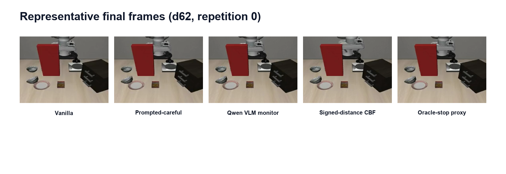

# CrashBench Progress Update

**Working title:** *Risk Is Not Intervention Value: Counterfactual Outcome Routing for VLA Safety*  
**Date:** August 24, 2026  
**Current stage:** The main experiments are finished. I am now organizing the paper.

## Short summary

The project now has one clear positive result and one clear limitation.

The positive result is that a safety system should not only ask, **“Is this state dangerous?”** It should also ask, **“What will happen if I continue, detour, or stop?”**

My Counterfactual Router predicts the outcome of three options:

- **Base:** continue with the original VLA policy.
- **Detour:** use a structured path around the hazard.
- **Hold / Retreat:** move away and stop safely.

At fresh matched decision states, the Router completes the task much more often than a binary risk detector, while keeping a similar crash rate.

However, the Router still cannot reliably find the correct intervention time when an episode starts from the beginning. In simple words:

> **Choosing the right action at a known decision point works well. Finding that decision point online is still difficult.**

## Why this problem matters

The early experiments showed that the VLA can represent an upcoming collision but still continue moving toward the obstacle.

The main evidence is:

- On-path walls caused crashes in **15/15** trials.
- Clearly off-path walls caused crashes in **0/33** trials.
- A simple probe predicted a collision within five steps with **AUC 0.998**.
- The policy did not show sustained final-window retreat in **25/25** wall episodes.
- When the probe triggered a structured retreat, crashes changed from **15/15 to 0/15**.
- The same guard triggered on **0/22** benign control episodes.

This gave the first important story:

> **The model contains useful safety information, but the original action policy does not use it correctly.**

## Main progress

I then moved from simple crash detection to intervention selection.

A binary risk detector only says “danger” and sends every dangerous state to the same retreat action. This can avoid some crashes, but it often stops the task unnecessarily.

The Counterfactual Router instead predicts three possible outcomes for every option:

- task success;
- catastrophe;
- safe noncompletion.

It keeps Base as the default and only changes the policy when another option has a clear predicted advantage.

## Best current result

The main fresh evaluation uses **8 independent source states**, with **3 matched conditions per source**, for **24 matched decisions**.

| Method | Task success | Catastrophe | Intervention |
|---|---:|---:|---:|
| Base | 66.67% | 33.33% | 0.00% |
| Binary Risk -> Retreat | 41.67% | 8.33% | 50.00% |
| Always Detour | 70.83% | 4.17% | 100.00% |
| **Counterfactual Router** | **87.50%** | **8.33%** | **58.33%** |
| Counterfactual Oracle | 91.67% | 0.00% | 33.33% |

The clearest comparison is Router versus Binary Risk:

- **+45.83 percentage points** in task success;
- the same observed catastrophe rate;
- only **+8.33 points** in intervention rate.

Compared with Always Detour, the Router has higher task success and uses much less intervention, although its catastrophe rate is slightly higher.

The stars in the figure are settings that passed all four planned checks. Four settings passed in the independent cohort.

My current main claim is:

> **At fresh matched decision states, predicting the outcomes of different interventions gives a better safety-success-intervention tradeoff than using risk alone.**

## What did not work

The difficult part is online timing.

The matched-state result assumes that the Router is already called at a useful decision point. I then tested whether it could start from episode reset and decide when to intervene.

### Sequential Router

The first sequential version gave a small improvement:

- task success: **58.3% -> 66.7%**;
- catastrophe: **33.3% -> 25.0%**;
- intervention: **16.7%**.

But it missed **2/2 known recovery opportunities**.

### Direct recovery-window model

I added dense recovery-window labels and trained a direct model. The offline result looked strong:

- recovery-open versus hard-control AUC: **1.000**;
- intervention-needed versus hard-control AUC: **0.995**;
- hard-control Base retention: **0.984**.

But the fresh sequential result failed:

- it selected Base in **24/24** episodes;
- it recovered **0/8** glass episodes;
- it missed **2/2** known recovery windows;
- fresh trajectory-level AUC was only **0.250**.

This is not only a threshold problem. The known recovery episodes scored below many safe controls. Lowering the threshold would trigger on safe trajectories first.

The main limitation is therefore:

> **Good state-level intervention ranking does not automatically become reliable online intervention timing.**

## Current limitations

- The main fresh result has only **8 independent source states**.
- The Router selects from structured, privileged options. It is not end-to-end learned recovery.
- The current method does not solve reliable intervention timing from episode reset.
- Task and layout diversity are still limited.
- In the combined 13-source analysis, no single operating point passes every check, so I should claim a useful frontier rather than universal dominance.

## Current status and next steps

I have closed the recovery-window experiment line. I do not plan to add another threshold search, GRU, Transformer, or new recovery cohort on the same setup.

My recommended next steps are:

1. Write the paper around the fresh matched-state Router result.
2. Use the wall, probe, and guarded-retreat results as motivation.
3. Keep the sequential experiments as a short and honest boundary section.
4. Finish the main figures, tables, captions, and reproducibility notes.
5. Only consider a second-task matched-state replication if it is important for the target venue.

## Questions for advisor feedback

1. Is the main story strong enough: positive matched-state routing plus an honest sequential limitation?
2. Should I write the paper now, or first repeat the matched-state experiment on a second task family?
3. Which venue should guide the paper length and experiment scope?
4. Should the sequential negative result stay in the main paper or mostly move to the appendix?

## One-sentence takeaway

> **Risk detection tells us that something may go wrong; counterfactual outcome routing helps decide whether to intervene and what to do, but reliable online timing remains open.**
