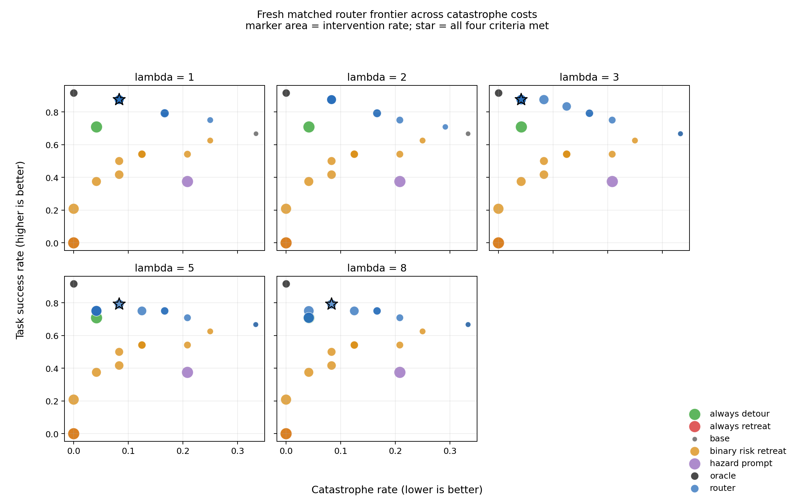

# CrashBench

Working paper title: **Knowing When to Intervene: Counterfactual Outcome
Routing for VLA Safety**.

CrashBench studies a practical failure of robot safety systems: predicting that
the Base policy may fail does not reveal whether intervention will help, which
intervention to use, or whether safety comes at the cost of abandoning the
task. The paper therefore reframes safety routing from binary failure detection
to option-conditioned outcome prediction.

## Main result

The frozen router predicts

```text
P(task success | state, option)
P(catastrophe | state, option)
P(safe noncompletion | state, option)
```

for Base, structured Detour, and structured Retreat. It evaluates
`U_lambda(option) = P(success) - lambda * P(catastrophe)` and keeps Base unless
the best intervention has a calibration-frozen advantage greater than `delta`.

On an independent fresh cohort of eight source states and 24 matched decisions,
the paper display point (`lambda=1,target=0.6`) is:

| Method | Task success | Catastrophe | Safe noncompletion | Intervention |
|---|---:|---:|---:|---:|
| Base | 66.67% | 33.33% | 0.00% | 0.00% |
| Hazard Prompt | 37.50% | 20.83% | 41.67% | 100.00% |
| Binary Risk -> Retreat | 41.67% | 8.33% | 50.00% | 50.00% |
| Always Detour | 70.83% | 4.17% | 25.00% | 100.00% |
| Always Retreat | 0.00% | 0.00% | 100.00% | 100.00% |
| **Counterfactual Router** | **87.50%** | 8.33% | **4.17%** | 58.33% |
| Counterfactual Oracle | 91.67% | 0.00% | 8.33% | 33.33% |

At a similar intervention rate, Router improves task success over binary-risk
routing by 45.83 points with the same catastrophe point estimate. Relative to
Always Detour, it gains 16.67 success points and uses 41.67 fewer intervention
points, with a 4.17-point higher catastrophe estimate. On off-path/no-glass
controls, Router retains 93.75% task success versus 56.25% for Hazard Prompt.



Four predeclared `(lambda,target)` points satisfy all four frontier criteria in
the independent cohort. The combined 13-source analysis meets each criterion
somewhere on the frontier but has no single all-criteria point. The result is a
new safety--success--intervention Pareto tradeoff, not a universally dominant
fixed operating point.

The complete seven-method outcome and intervention-quality tables, metric
definitions, plain-language interpretation, figures, confidence intervals, and
caveats are in [the canonical main-result document](docs/COUNTERFACTUAL_ROUTER_MAIN_RESULT.md).

## Paper spine

1. **Risk is not intervention value.** Exact-state branches show that Detour can
   rescue Base catastrophes but can also damage Base successes; Retreat is often
   safe without completing the task. No fixed option is uniformly correct.
2. **Predict consequences, then route conservatively.** A deliberately small
   single-frame model predicts three outcomes for every option and overrides
   Base only when expected advantage clears a frozen margin.
3. **Test the full frontier online.** Base, Hazard Prompt, Binary Risk, Always
   Detour, Always Retreat, Router, and Oracle are evaluated on the same fresh
   source placements, seeds, initializations, and exact T-20 branch states.
   Uncertainty is clustered by source state.
4. **Use diagnosis as mechanism support.** Earlier wall experiments show the
   motivating “decoded but not routed” gap: imminent collision is linearly
   readable while unsafe action continues, and an explicit
   `risk-readout → controller` interface can stop collision. The new headline
   advances from detecting failure to choosing valuable intervention.

The structured Detour controller uses privileged geometry, and Oracle observes
realized branches. Accordingly, the paper claims learned routing over structured
options, not an end-to-end learned recovery policy.

## Dynamic first-crossing closeout

E16 establishes intervention-value routing at matched T-20 decision states; it
does not by itself establish reliable from-reset trigger timing. P2 evaluates
that stronger deployment question separately. Source-level sequential
calibration reduces repeated-look over-triggering to 16.7% and, on four stable
development sources (12 episodes), changes Base success/catastrophe from
58.3%/33.3% to 66.7%/25.0%. However, it misses both known T-20-recoverable
glass episodes.

The P2.5 morphology audit closes the obvious threshold/accumulator follow-up.
Across the two missed treatments and seven Base-success controls, raw maximum
has pairwise AUC 0.357; the best simple temporal alternatives (MA-3/5/8) reach
only 0.286. One missed episode has sustained Detour evidence, the other only a
short burst, while several controls are also persistently high. The limitation
is therefore not just one-step spikes or a badly chosen scalar boundary.

This result is a development diagnosis, not a new project-level GO/NO-GO. E16
remains the headline matched-decision result; the paper must not claim that the
current single-frame score reliably knows when to intervene from reset. If that
claim is pursued, the minimum next method change is explicit recovery-window
supervision, before a temporal value model. Further instantaneous-threshold or
simple evidence-accumulator tuning on this cohort is closed.

## Repository map

```text
crashbench/                 reusable scenario, policy, probe, and router code
scripts/                    experiment, training, and analysis implementations
setup/                      current environment and Quest submission guide
results/                    promoted summaries, full tables, frontiers, and figures
docs/                       current paper truth sources and frozen protocol
docs/appendix/              supporting and negative evidence
docs/archive/               superseded plans, execution records, and reports
legacy/                     path-stable historical orchestration helpers
```

Historical files remain at stable paths when manifests, tests, or provenance
records depend on them. They are not competing current entrypoints.

## Start here

- [Main result and interpretation](docs/COUNTERFACTUAL_ROUTER_MAIN_RESULT.md)
- [Current paper state](docs/CURRENT.md)
- [Paper plan](docs/PAPER_PLAN.md)
- [Claim ledger](docs/CLAIMS.md)
- [Fresh online protocol](docs/FRESH_COUNTERFACTUAL_ROUTER_PROTOCOL.md)
- [Experiment index](docs/EXPERIMENT_INDEX.md)
- [Reproducibility and data availability](docs/REPRODUCIBILITY.md)
- [Simple group-meeting explanation of the router and options](docs/GROUP_MEETING_ROUTER_EXPLAINER.md)
- [P1 timing-choice benchmark](docs/P1_TIMING_CHOICE_BENCHMARK.md)
- [P2 dynamic first-crossing protocol](docs/P2_DYNAMIC_FIRST_CROSSING.md)
- [P2 development result](results/P2_DYNAMIC_FIRST_CROSSING_DEV_20260818.md)
- [P2 sequential first-crossing result](results/P2_SEQUENTIAL_FIRST_CROSSING_DEV_20260819.md)
- [P2.5 score-trajectory morphology audit](results/P2_TRACE_MORPHOLOGY_AUDIT_20260819.md)
- [Appendix index](docs/appendix/README.md)
- [Legacy archive](docs/archive/README.md)

## Zero-GPU verification

```bash
pip install -e .
PYTHONDONTWRITEBYTECODE=1 python -m pytest -p no:cacheprovider tests -q
PYTHONDONTWRITEBYTECODE=1 python scripts/audit_repo.py
git diff --check
```

These checks validate tracked metadata, frozen claim values, scenario
fingerprints, promoted E16 assets, and local links. They do not reproduce GPU
rollouts or restore ignored hidden-state/video assets.

No archival citation or license file is currently supplied; add both before an
external release.
