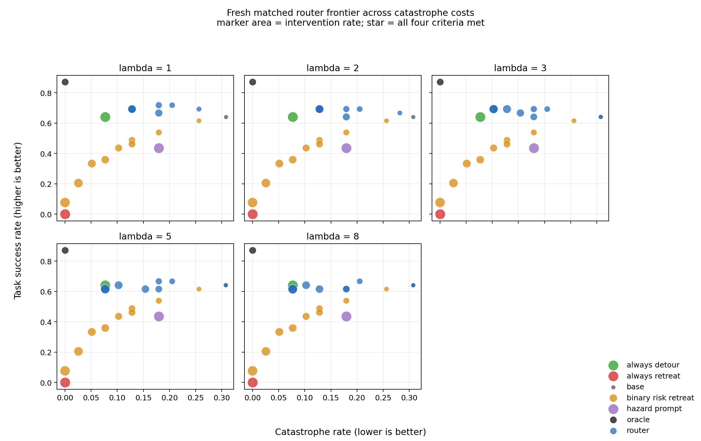

# Fresh counterfactual router: main paper result

This is the canonical paper-facing interpretation of E16. Development sweeps,
exact-state option audits, failed fixed-point confirmations, and cluster-side
execution details remain available through the linked provenance documents, but
they are not competing paper narratives.

## Result in one sentence

A frozen, single-frame outcome router learns **intervention value rather than
risk alone**: on an independent fresh matched cohort it reaches 87.5% task
success and 8.33% catastrophe at 58.33% intervention, compared with 41.67%,
8.33%, and 50.0% for a rate-matched binary-risk-to-Retreat policy.

The supported claim is a new deployable safety--success--intervention tradeoff,
not universal dominance, end-to-end learned recovery, or production-scale
generalization.

## Plain-language story

At a potentially hazardous state, a safety system can keep the Base policy,
take a structured detour, or retreat. A binary risk detector asks only whether
the state looks dangerous and therefore maps every alarm to the same retreat.
The counterfactual router instead asks what each option is likely to cause:

```text
current VLA state + candidate option
    -> P(task success), P(catastrophe), P(safe noncompletion)
    -> success probability - lambda * catastrophe probability
    -> override Base only when the predicted advantage exceeds delta
```

This distinction matters because avoiding catastrophe is not the same as
finishing the task. Retreat can be safe but useless, while detouring everywhere
can preserve safety at the cost of constant intervention. The router is a
conservative dispatcher: Base remains the default, and a structured option
takes over only when its predicted counterfactual benefit is large enough.

### 中文白话解释

Base 是“继续照原计划做”，Binary Risk 是“觉得危险就统一后退”，Always
Detour 是“不管有没有必要都绕路”，Hazard Prompt 是“从任务开始就一直提醒
小心”，而 Router 会分别估计继续、绕路和撤退之后最可能发生什么。这个实验
说明：真正有价值的不是只会报警，而是知道**何时接管、接管后应该做什么**。
Router 没有在所有维度击败 Always Detour；它提供的是一个固定策略没有的新
Pareto 点：高得多的任务成功率、较低的事故率，以及明显少于全程绕路的干预。

## Seven methods in the matched comparison

| Method | Operational meaning |
|---|---|
| Base | Run the frozen task policy without a safety override. |
| Hazard Prompt | Give the exact hazard-specific instruction from episode reset; counted as intervention for the whole episode. |
| Binary Risk -> Retreat | Predict Base catastrophe risk and route every positive decision to `RetreatHold`. |
| Always Detour | Execute the frozen privileged `DetourComplete` option at every matched decision. |
| Always Retreat | Execute `RetreatHold` at every matched decision. |
| Counterfactual Router | Predict the three outcomes for every option and conservatively override Base using `U_lambda`. |
| Counterfactual Oracle | Select after observing realized branches; an unattainable upper bound, excluded from deployable Pareto dominance. |

## Independent fresh confirmation table

The headline slice is the independent random-reset cohort: eight source states,
three matched conditions per source, and 24 matched decisions. The displayed
Router is the predeclared `lambda=1, target intervention rate=0.6` point. The
binary-risk row uses the corresponding 0.6 calibration target. This is one of
four all-criteria points in the fully predeclared frontier, not a prespecified
single deployment point selected before all outcomes were observed.

### Outcomes

| Method | Task success ↑ | Catastrophe ↓ | Safe noncompletion ↓ | Intervention ↓ | Mean utility, λ=1 ↑ |
|---|---:|---:|---:|---:|---:|
| Base | 66.67% | 33.33% | 0.00% | 0.00% | 0.333 |
| Hazard Prompt | 37.50% | 20.83% | 41.67% | 100.00% | 0.167 |
| Binary Risk -> Retreat | 41.67% | 8.33% | 50.00% | 50.00% | 0.333 |
| Always Detour | 70.83% | 4.17% | 25.00% | 100.00% | 0.667 |
| Always Retreat | 0.00% | **0.00%** | 100.00% | 100.00% | 0.000 |
| **Counterfactual Router** | **87.50%** | 8.33% | **4.17%** | 58.33% | **0.792** |
| Counterfactual Oracle | 91.67% | 0.00% | 8.33% | 33.33% | 0.917 |

Here `U_1 = task_success_rate - catastrophe_rate`. Safe noncompletion is a
non-catastrophic rollout that does not complete the task.

### Intervention quality and Oracle-relative value

| Method | Unnecessary intervention¹ ↓ | Base successes overridden² ↓ | Missed beneficial intervention³ ↓ | Beneficial opportunities missed⁴ ↓ | Mean Oracle regret ↓ | Oracle value recovered ↑ |
|---|---:|---:|---:|---:|---:|---:|
| Base | 0.00% | 0.00% | 33.33% | 100.00% | 0.583 | 0.00% |
| Hazard Prompt | 66.67% | 100.00% | 0.00% | 0.00% | 0.750 | -28.57% |
| Binary Risk -> Retreat | 25.00% | 37.50% | 8.33% | 25.00% | 0.583 | 0.00% |
| Always Detour | 66.67% | 100.00% | 0.00% | 0.00% | 0.250 | 57.14% |
| Always Retreat | 66.67% | 100.00% | 0.00% | 0.00% | 0.917 | -57.14% |
| **Counterfactual Router** | 29.17% | 43.75% | **4.17%** | **12.50%** | **0.125** | **78.57%** |
| Counterfactual Oracle | 0.00% | 0.00% | 0.00% | 0.00% | 0.000 | 100.00% |

1. Base would succeed but the method overrides it, divided by all decisions.
2. The same count divided only by decisions where Base would succeed.
3. Oracle has positive value over Base but the method retains Base, divided by
   all decisions.
4. The same count divided only by decisions with a beneficial intervention.

Hazard Prompt has zero missed-beneficial interventions only because it is
defined as intervening from every episode reset. Its 100% override rate, 37.5%
success, and negative recovered value show that this is not effective routing.

## Paired evidence and controls

All confidence intervals use 5,000 shared source-state cluster-bootstrap
replicates; frames, conditions, and rollout branches are not treated as
independent samples.

| Paired comparison, Router minus baseline | Point difference | Source-cluster bootstrap 95% CI |
|---|---:|---:|
| Task success vs Binary Risk -> Retreat | +45.83 points | [+25.00, +66.67] |
| Catastrophe vs Binary Risk -> Retreat | 0.00 points | [-12.50, +12.50] |
| Intervention vs Binary Risk -> Retreat | +8.33 points | [-8.33, +29.17] |
| Task success vs Always Detour | +16.67 points | [+4.17, +29.17] |
| Catastrophe vs Always Detour | +4.17 points | [0.00, +12.50] |
| Intervention vs Always Detour | -41.67 points | [-62.50, -20.83] |

On the 16 off-path/no-glass control decisions, Router retains 93.75% task
success at 43.75% intervention. Hazard Prompt reaches only 56.25% task success
and intervenes on 100%. Router task-success, catastrophe, intervention, regret,
and recovered-value intervals are stored in the machine-readable analysis.

## What the frontier figure says

The horizontal axis is catastrophe rate (left is better), the vertical axis is
task success (up is better), and marker area is intervention rate (smaller is
less intrusive). The five panels vary catastrophe cost `lambda`; blue/orange
points vary the calibration target and therefore the conservative handoff
threshold. A star marks a point satisfying all four acceptance criteria at
once. The desired region is the upper left with a small marker.


Four predeclared points jointly pass all criteria in the independent cohort:
`(lambda,target) = (1,0.6), (3,0.7), (5,0.6), (8,0.6)`. This is why the paper
reports a frontier instead of hiding the result behind one fixed catastrophe
cost.

Pooling the disjoint five-source default-state pilot with the independent
eight-source random-reset cohort gives 13 sources and 39 decisions. Each
frontier criterion is met somewhere in the pooled frontier, but no single
pooled point meets all four. That heterogeneity is a limitation, not a failed
artifact or a license to tune another model.



## Supported and unsupported wording

Supported:

> A frozen probabilistic outcome router contributes new deployable
> safety--success--intervention tradeoffs on fresh matched online rollouts. At a
> similar intervention rate it can outperform binary risk routing, and it
> retains controls better than a hazard prompt.

Not supported:

- one prespecified deployment point dominates every baseline and both cohorts;
- the router is universally safer than Always Detour;
- the structured privileged options constitute end-to-end learned recovery;
- eight independent sources establish production-scale robustness.

The original `lambda=5,target=0.4` fixed-point audit and the post-pilot
`lambda=5,target=0.2` audit remain negative in the sealed artifacts.

## Stable artifacts and reproduction

- Paper summary: [`counterfactual_router_fresh_online_20260817.json`](../results/counterfactual_router_fresh_online_20260817.json)
- Complete seven-method table: [`counterfactual_router_fresh_online_main_table.csv`](../results/counterfactual_router_fresh_online_main_table.csv)
- Independent analysis/frontier: [`n8_analysis.json`](../results/counterfactual_router_fresh_online_n8_analysis.json), [`n8_frontier.csv`](../results/counterfactual_router_fresh_online_n8_frontier.csv)
- Combined analysis/frontier: [`n13_analysis.json`](../results/counterfactual_router_fresh_online_n13_analysis.json), [`n13_frontier.csv`](../results/counterfactual_router_fresh_online_n13_frontier.csv)
- Fixed-`lambda=5` audit figures: [`n8`](../results/counterfactual_router_fresh_online_n8_frontier_lambda5.png), [`n13`](../results/counterfactual_router_fresh_online_n13_frontier_lambda5.png)
- Frozen protocol: [FRESH_COUNTERFACTUAL_ROUTER_PROTOCOL.md](FRESH_COUNTERFACTUAL_ROUTER_PROTOCOL.md)
- Development and full-capture provenance: [COUNTERFACTUAL_ROUTER_HANDOFF.md](COUNTERFACTUAL_ROUTER_HANDOFF.md)

The main executable path is
`train_counterfactual_outcome_router.py -> collect_fresh_counterfactual_router.py
-> analyze_fresh_counterfactual_router.py`; Quest submission wrappers live in
`setup/submit_fresh_counterfactual_router*.sh`.
