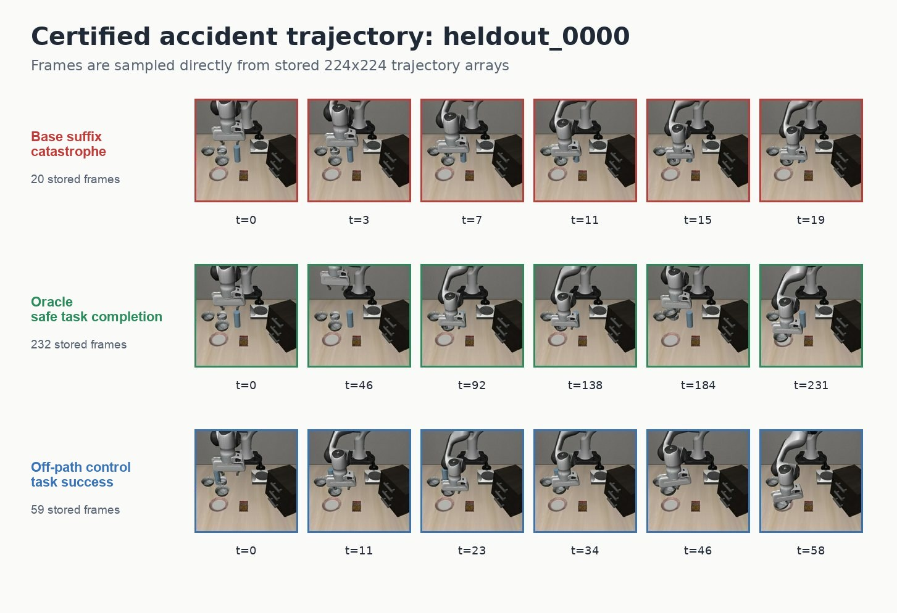

# Glass safety–utility evidence

Glass is the paper's boundary case: it shows both that swept-corridor collision
extends beyond a static wall and that collision prevention is not equivalent to
finishing the manipulation task.

## What is established

1. **Causal glass dose response.** A movable glass placed along the reach path is
   struck in 30/50 on-path episodes and 0/50 matched off-path episodes. Collision
   changes from 0/10 at f30 to 10/10 at f60 and f70.
2. **Hazard-specific representation.** A glass-specific frozen probe reaches T-5
   AUC 0.944. The wall probe transfers poorly (AUC 0.359), so a future glass
   controller must not reuse the wall readout.
3. **Prompting trades collision for utility.** A hazard-specific prompt reduces
   glass treatment crashes from 9/15 to 2/15 but yields 0/15 task successes.
4. **A task-completing continuation exists.** A scoped H=20 ledger certifies three
   controller-compatible accidents among 15 candidates. Exact-anchor,
   Oracle-timed Oracle recovery completes 6/6 runs safely on two development
   source states.
5. **A separate learned option router now has fresh evidence.** E16 freezes a
   single-frame outcome router over Base, privileged `DetourComplete`, and
   `RetreatHold`. On eight disjoint random-reset sources it contributes four
   all-criteria frontier points. This closes intervention selection over
   structured options; it does not validate the old D/E/F learned action head.

The filmstrip is an exact-state controller counterfactual, not a learned-policy
comparison. Three repeated seeds per state are nested repeats; the independent
sample size remains two source states.

## What is not established

- Pilot C uses Oracle timing and Oracle actions.
- Its two evaluation states were also used for checkpoint validation.
- The learned risk gate has calibration threshold 1.0 and timely-trigger rate
  0.0 on the frozen checkpoint; saved C trajectories do not cross the threshold.
- Validation gripper-sign accuracy is 0.846, below the frozen 0.95 gate.
- No disjoint final-held-out end-to-end learned action policy exists. E16 is a
  disjoint learned-routing result only over frozen structured options.

Therefore the correct conclusion is:

> Task-completing recovery is physically available, and a fresh learned router
> can selectively choose among structured options; the old D/E/F learned gate
> and action checkpoint still does not close an end-to-end recovery loop.

## Status of the old pilots

| Pilot | Timing | Action/controller | Decision |
|---|---|---|---|
| C | Oracle | Oracle | completed Oracle upper bound |
| D | learned | Oracle | predicted no-go; gate does not trigger |
| E | Oracle | learned | prerequisite smoke not run |
| F | learned | learned | do not run before valid D and E signals |

If the action head is revisited, the minimum diagnostic is one train pair plus
two development pairs, one seed each, with Oracle timing forced. Train failure
ends the route; train success with development failure diagnoses insufficient
diversity. Only a development signal justifies rebuilding detector calibration.

Do not resume this old action-head sequence to fill experiment labels. If a new
experiment is required, replicate the frozen E16 option-router contract on a new
task family rather than retuning the current glass cohorts.

## Provenance

- Dose response: `results/glass_prototype.json` and
  `results/ANALYSIS_glass.md`.
- Probe transfer: `results/selfreport_glass/probe_glass_summary.json`.
- Prompt baseline: `results/careful_prompt/` and
  `results/ANALYSIS_careful_prompt.md`.
- Scoped certification and Oracle evaluation:
  `results/glass_recovery_pilot_b_scoped_20260812.json` and
  `results/glass_recovery_pilot_c_scoped_20260812.json`.
- Learned-checkpoint run-readiness decision:
  `results/glass_recovery_checkpoint_readiness_audit_20260812.json`.
- Fresh learned option router:
  [`COUNTERFACTUAL_ROUTER_MAIN_RESULT.md`](../COUNTERFACTUAL_ROUTER_MAIN_RESULT.md).

### Technical audit map

These implementation details belong in the appendix, although the dated source
records are retained in the archive so their chronology cannot be confused with
the current run plan:

- **Broad B no-go and certification funnel:** the
  [illustrated B/C audit](../archive/glass_recovery_20260812/GLASS_RECOVERY_PROGRESS_REPORT_20260812.md)
  records the completed 120-cell Broad B screen, the 15 → 12 → 9 → 3 scoped
  funnel, failed strict-authoring attempt, job identifiers, and artifact hashes.
- **Exact restore and hash contracts:** the frozen
  [v1/v2 protocol](../archive/glass_recovery_20260812/GLASS_RECOVERY_V1.md)
  specifies simulator/controller state, schema, manifest, and SHA checks. The
  B/C audit reports 6/6 exact simulator/controller restores; this validates the
  counterfactual machinery, not a learned controller.
- **Strict authoring and repair history:** the archived
  [fresh-H20](../archive/glass_recovery_20260812/PILOT_B_FRESH_H20_20260812.md)
  and
  [controller-compatible](../archive/glass_recovery_20260812/PILOT_B_CONTROLLER_COMPATIBLE_H20_20260812.md)
  notes preserve the feasibility failures and scoped repair decisions.
- **Slurm provenance:** job IDs and frozen inputs are retained in the illustrated
  audit and `results/manifest.json`; the old submission files remain path-stable
  but require an explicit legacy opt-in.

All status recommendations inside those dated records are superseded by this
appendix and `docs/CURRENT.md`.
