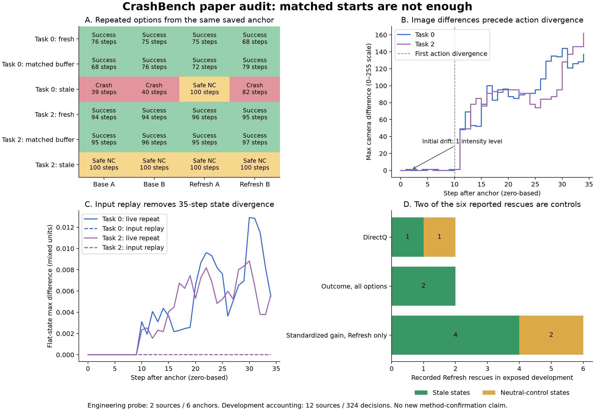

# CrashBench：面向论文的综合研究审查与推进建议｜2026-09-06

**综合判断：方向值得继续，但目前最值得推进的工作已经不是再换一个小预测头。我们需要把“干预效果”“执行本身的波动”和“部署输入能否预测这种效果”分开。**前两轮修复让研究重新可迭代；本轮则发现，实验测量链路本身还有会影响论文解释的问题。

这次不是只写建议。我复查了实现、已有 D5/两轮预测、任务与条件分组、源级影响、效用偏好和近邻文献，并在 Quest 完成两个训练源工程实验。主要新发现是：

1. 同一个 exact-state bundle 下，同一个选项重复执行也会发生轨迹分叉；一个 Refresh 重复对甚至从“安全未完成”变成“事故”。
2. 在同一进程的两次运行中，微小相机像素差异先出现；重放相同策略输入消除了两个锚点上 35 步的动作/状态差异。跨作业又有额外的初始动作差异，因此根因不能简化为“只有渲染器”。
3. 第二轮报告的 6 次 Refresh 成功中，4 次来自 stale，2 次来自 matched-buffer control。原统计没有算错，但不能把这 6 次全部解释成修复了观测陈旧。
4. 当前最好效用并不代表总体任务完成更好；改变事故代价偏好，方法相对 Base 的效用差甚至会变号。
5. 单次结果构造的 Oracle 上界不一定等于模型能学到的空间。若随机波动和信息缺失很大，“Oracle 很强、模型很弱”不能只归因于模型能力不足。

**我的建议是保留方法论文方向，同时把一套可信的恢复评估与可学习性诊断作为论文基础。**不要永久降级为 negative paper，也不要把新发现的实现问题包装成方法成功。发现一个 bug 本身还不足以形成强论文；系统解释它影响了哪些结论，并建立可验证的改进，才有研究价值。

## 一、本轮做了什么，以及证据边界

起点为第二轮完成提交 `cc4fdb1`，工作分支 `codex/paper-direction-audit`。原实验结果、原模型与原论文材料全部保留。

| 工作 | 实际完成内容 |
|---|---|
| 静态审查 | 采集器、策略 continuation、观察队列、快照恢复、干预语义、数据持久化、标签和论文主张 |
| 既有数据复算 | D5 train/development 条件分组、风险/收益象限、恢复/损害归因、源级 bootstrap、符号翻转诊断、留一源影响、固定策略效用偏好敏感性 |
| 工程实验 A | 2 个训练源、6 个新工程锚点，每锚点 Base×2、Refresh×2，最多 100 步，共 24 条分支；保存完整 bundle/queue 和逐步记录 |
| 工程实验 B | 从 A 保存的两个 fresh-control bundle 跨进程恢复；live A、live B、输入重放 A，各 35 步，记录各图像/状态字段差异 |
| 相关工作 | 核验 8 项主要原始论文/文献来源，重点对比风险检测、恢复策略、候选选择、执行验证和选择偏差 |
| 验证 | 全仓 **538 项测试通过**；工程输出 **44 个文件哈希**核对通过；仓库审计通过 |

Quest 作业 `5628711` 完成，退出码 `0:0`，耗时 **5 分 5 秒**；作业 `5629071` 完成，退出码 `0:0`，耗时 **2 分 43 秒**。各使用一张 A100，峰值主存约 18.6 GiB。这些都是已暴露训练源上的工程诊断，**没有新确认集、没有 D8 调优，也不是对原 D5 锚点的精确复演**：旧采集器没有保存可直接重放的完整原锚点 bundle。本轮新锚点现已保存。

检查的 `libero_adapter.py`、`pi0_policy.py`、`branching/state.py`、`observation_staleness.py` 与 D5 执行提交 `fe660c168e72` 的代码内容未变。这增强了检查的相关性，但不能替代对历史环境二进制/驱动的核验，更不能把 π0 两源结果外推为所有历史 OpenVLA 实验无效。

## 二、最重要的新问题：起点恢复通过，不等于后续结果可重复

**证据级别：已实测；P1，影响对每个状态“哪种干预有效”的解释。**

工程实验 A 从同一已保存 bundle 恢复后，比较同选项重复：6 个锚点 × Base/Refresh 两种选项，共 12 对。

- **12/12 对动作序列不完全相同，12/12 对物理状态序列不完全相同。**
- **1/12 对终局类别不同。**这是 task 0 的 stale 锚点：Refresh A 执行 100 步、安全未完成；Refresh B 在第 82 步发生事故。
- 新鲜/匹配缓存控制中的终局多数仍成功，但用时和轨迹会变；不能把“终局相同”当作逐步复现。
- 每次起点的现有恢复审计均通过。问题发生在其后。

这不能说明所有分支标签都错，也不要求研究必须追求所有像素逐比特相同。它说明：**现有单次配对结果混合了干预效应与执行波动；如果要给状态贴“可恢复/不可恢复/有益干预”硬标签，必须测量标签对重复执行的稳定程度。**

对应实现：`branching/state.py` 审计了声明的快照组件；`BranchEngine` 默认可以只做一次分支。原 D5 采集器为每个 option 使用单次结果。开始相同、观察相同、动作相同、结果分布相同，是不同层次的条件，不能由一个 hash 概括。

### 观测重放进一步定位了什么？

工程实验 B 的 live A/live B 比较：

| 锚点 | 最早输入差异，步号从 0 计 | 最早动作/物理状态差异 | 完整输入重放 A 的结果 |
|---|---|---|---|
| Task 0 fresh control | step 1：wrist image 仅 3 个 RGB 数值变化，最大 1/255；其他相机及 proprio 相同 | step 10 | 35 步观测输入、动作、状态全相同 |
| Task 2 fresh control | step 2：wrist image 仅 6 个 RGB 数值变化，最大 1/255；其他相机及 proprio 相同 | step 10 | 35 步观测输入、动作、状态全相同 |

这支持：在这两个同进程对照中，图像观察流的微小变化位于动作/物理分叉上游。**它没有证明某个单独像素导致某次事故**：我们重放了完整输入序列，且只观察 35 步；没有逐像素干预，也未在这一步测完整终局。

另外，对两个作业的首次运行做跨进程比较时，记录的初始 observation hash 和 policy-continuation hash 一致，但初始动作最大差分别约 **0.001283、0.001279**。当前没有覆盖所有推理输入、参数/编译状态和运行时身份的独立核对，因此不能把这直接归因为某个 GPU 算子。它说明**固定观测不是已经验证的跨进程万能修复**；完整模型/运行时复现仍需单独检查。

## 三、旧数据中的中性控制也存在反事实不一致

**证据级别：已复算；原因与新工程实验相容，但没有逐一重放旧状态证明同根因。**

在 fixed anchor=5/10/15、π0 每 5 步重查询的当前实现中，anchor 位于 chunk 边界。π0 的 `reset()` 只清空 action queue；fresh-control 使用无延迟队列，matched-buffer-control 每步刷新到当前观察。若其余执行完全一致，Base 和 Refresh 在这些控制条件下应具有相同策略输入和有效动作；额外调用成本可以不同，终局不应被当作预期的 staleness 修复效应。

| D5 角色 | 两类中性控制决策数 | Base/Refresh 终局不同 | 涉及的独立源 |
|---|---:|---:|---:|
| Train | 432 | 17 | 10 |
| Development | 216 | 10 | 8 |

开发集原有 11 个 `Base 未成功 → Refresh 成功` 状态中，**8 个来自 stale，3 个来自 matched-buffer control**。第二轮标准化收益模型在 Base/Refresh 模式找回的 6 次成功，则是 **4 个 stale + 2 个 control**。

因此前两轮数字保留为“已记录反事实分支的离线选择结果”，但论文不能把它们全部称为 staleness recovery。那 4 个 stale 结果也需要重复稳定性检查，不能因控制条件被识别就自动认证其余状态。

这不适合处理成“删掉所有不合预期标签再重训”。正确做法是保留原结果，追加原因分类、同选项重复、期望收益估计，并使用新版本数据记录修复。27/648 也不能直接当成一个统一噪声率，从模型成功数里机械扣除。

## 四、采集器还有两个容易被忽视的设计问题

### 4.1 不同条件之间没有恢复相同的策略 RNG 起点

**证据级别：代码与最小反例确认；P1/P2，取决于是否宣称跨条件的严格配对因果比较。**

`collect_staleness_statewise.py:178–198` 在不同 anchor/severity/condition 之间调用 `env.seed(reset_seed)` 和 `policy.reset()`。但 [`Pi0Policy.reset()`](../../../../crashbench/policies/pi0_policy.py) 仅清队列，**不恢复内部 JAX RNG**。一个 policy 对象贯穿多格采集，其随机流随前面的推理推进。

所以，同一 physical source 并不意味着不同条件使用了相同 nominal policy 随机实现。这可能让条件/严重度差异同时包含策略随机抽样的差异。它**不等于**同一个 block 的 Base/Refresh 没有恢复 policy RNG；那部分确实有 continuation 恢复。应区分这两层配对。

修复位置应在采集编排：进入每个比较条件前恢复声明的初始 policy continuation。不要简单把 `policy.reset()` 改成全局重置 RNG，因为 Refresh 也调用它；那会在处理臂中额外换随机流，改变 option 语义。本轮工程实验采用了显式恢复初始 continuation 的方式。

### 4.2 完整锚点与部署所需上下文没有被持久化

**证据级别：代码确认；P1，影响复现和后续数据利用。**

旧采集器保存 delivered observation blob、bundle ID、queue hash，但其完整 bundle 和队列内容主要留在进程内，结果表没有指向可重放的完整序列化锚点。**hash 是身份信息，不是被哈希的状态本身。**这也是本轮不能直接重放历史某一条有争议分支的原因。

现有 104-D 输入只有两相机 4×4 均值和 8 维状态，没有显式 observation age、当前 nominal chunk、历史序列。不能从 severity 标签或 anchor_steps 偷换出“可部署的 age”。本轮探针已把自己的完整 bundle+queue 持久化，但没有改写旧采集结果。

未来应同时保存：完整环境/控制器/策略/队列状态；实际给策略和选择器的输入；时间戳与 nominal proposal；必要的模型与运行时指纹；分支逐步/终局信息。不要把所有信息直接塞给 learner，数据保存范围和部署输入范围应分别声明。

## 五、论文主张需要更清楚的任务与效用语义

### 5.1 现在主要评价固定早期锚点的选择，还不是在线临界接管

D5 anchors 固定在 5/10/15 个策略动作后。Base 的 98 次 train+development 事故中，没有一次出现在分支开始后的前 5 步；开发事故最早在分支第 21 步。当前数据支持“这些给定状态后有不同的执行结局”，不直接支持“模型在线找到了马上要撞的时刻”。

采集器的 pre-anchor loop 主要检查 episode 结束，没有连续记录/拒绝先前超过事故阈值的事件。本次没有证据证明所保留锚点已经发生过事故；这里指出的是 pre-crash 资格记录不充分。若论文使用临界恢复表述，应补齐事故发生前资格、lead time 与在线触发测量，而不是仅依赖一个固定 H。

### 5.2 效用提高可能主要奖励了停止

第二轮最好点估计 interaction-500：U0=0.4370，Base=0.3932；但成功率 **64.81% < 68.21%**。它在 stale 中获得总效用增量约 +27.91，在 fresh/MBC 控制中分别损失 −8.30、−5.43；13 个原 Base 成功损失中，**11 个在控制条件**。

标准化收益模型允许 Stop 时损失 49 个原 Base 成功，其中 **41 个在控制条件**。这种错误不能被一个更低的事故率隐藏。

固定模型选择，只重新计量事故代价系数，不重新优化：

| 相对 Base 的平均效用差 | 事故代价 1 | 事故代价 2（原目标） | 事故代价 5 |
|---|---:|---:|---:|
| Interaction-500，三个选项 | −0.0118 | +0.0438 | +0.2104 |
| Interaction-500，Base/Refresh | +0.0095 | +0.0219 | +0.0589 |
| 标准化收益-500，Base/Refresh | +0.0067 | +0.0098 | +0.0190 |

这不是要求改到最有利的系数。它说明论文需要明确任务偏好，并独立报告成功保存、新增事故和干预负担，不能将一个效用排名翻译成全面更好的机器人能力。

### 5.3 这里的 Refresh 是软件观察队列重置，不应扩大成任意传感器延迟恢复

该 option 从环境获得 fresh observation、刷新队列并重查询策略。对软件缓冲陈旧，这是可解释的操作；如果真实传感器本身无法即时产生新帧，就不能假定同样的信息可免费取得。当前 simulator 同步调用的推理耗时没有完整转化为继续执行旧 chunk 的物理延迟。

论文应声明：新鲜信息从哪里来、何时可获得、获取/推理延迟怎样影响动作。不能因为代码把 option 标为 deployable，就略过这个部署条件。

### 5.4 “事故”和“安全未完成”是当前协议的标签，不能扩成所有物理安全

D5 的 catastrophe 使用机器人接触力达到 75 N 的阈值代理；它不是对所有损坏、跌落或危险事件的完整检测。safe_noncompletion 则包含在有限分支时域内未成功且未触发该阈值的执行。Stop 的短执行后退出也不能证明物体随后不会失稳。论文应把代理、观察时域和终止语义写清楚；本轮没有为改善数字而修改阈值。

## 六、最有研究价值的区分：Oracle 空间不等于可学习空间

这是我认为最值得发展为论文问题的一点。

在开发数据上，Base U0=0.3932，完整已知结果 Oracle=0.6048。一个**使用真实 Base 事故标签的特权二值风险诊断 Oracle**，按 R=0 选 Base、R=1 选 Stop，已达到 0.5640，约覆盖完整 Oracle 相对 Base 空间的 **80.7%**。它不是可部署基线，不能拿来宣称已有 detector 达到该效果；它只是量化了任务中“知道要撞就停”已能获得多少效用。

当前开发象限为 R0/B0=284、R0/B1=8、R1/B1=32、R1/B0=0。因此，仅说 risk 和 benefit 不同还不够。对方法论文更有价值的部分，是那种不能靠“风险高就停”完成的任务恢复，以及正常成功的保存。

还要区分两个 Oracle：

```text
一次执行后挑赢家：       E[max_o U_o]
根据可部署输入选期望赢家： E_X[max_o E(U_o | X)]
```

前者一般不小于后者。单次分支结果存在不可观测波动时，事后 Oracle 会利用“这一回哪条分支走运了”；learner 在执行前并不能利用未来噪声。完整状态 z 与部署观察 X 的信息差，还会进一步扩大距离。

这个不等式本身不是新理论贡献。研究机会是：**在 VLA 干预评价中，实际测出多少表观 Oracle 空间来自稳定干预效应，多少来自随机波动或部署信息缺失，并证明怎样的输入或评估方式能缩小这个差距。**

最小的实验设计是对同一源/锚点/option 做多次重复，一部分重复用于选 option，另一部分重复用于评价该选择，避免同一批随机结果既选赢家又计分。同时保留同选项重复作为零效应参照。重复次数增加不能替代独立 source 数；暂时不需要再堆大模型。

## 七、现有统计证据能支持多强的判断？

以 source 为单位，相对 Base：

| 固定第二轮选择器 | ΔU0 | 95% source bootstrap | 源级赢/平/输 |
|---|---:|---|---|
| Interaction-500，三个选项 | +0.0438 | [−0.0262, +0.1097] | 6 / 0 / 6 |
| Interaction-500，Base/Refresh | +0.0219 | [−0.0100, +0.0531] | 6 / 1 / 5 |
| 标准化收益-500，Base/Refresh | +0.0098 | [−0.0206, +0.0383] | 5 / 0 / 7 |

对应源级双侧符号翻转诊断 p 约 0.257、0.219、0.583；该检验依赖源级差值符号对称/交换性，且未校正模型选择，不能当作随机试验的精确因果 p 值。

逐一移除单个源后，三个正点估计仍保持正值，所以“完全由一个源撑起来”也不是准确描述。但 12 个源的不确定性仍大，模型/epoch/mode 又已经反复比较；普通 bootstrap 不能清除这种选择偏差。[Cawley 与 Talbot 的研究](https://www.jmlr.org/papers/v11/cawley10a.html) 对有限样本模型选择的这个问题有系统分析。

后续可以做 source-level cross-fitting 作为开发诊断，并按固定任务组成分层重采样。新的确认性结论需要在开发完成后取得独立来源的证据。不能把 324 个决策或五个优化 seed 当成 324/60 个独立环境。

## 八、怎样朝论文推进，而不是继续无休止地修入口？

我建议一个主线问题，分为可并行写作的诊断部分与待验证的方法部分：

> **VLA 干预的真实可利用收益有多少；选择器在实际可获得的信息下，能否保留正常任务，并选择稳定有益的恢复？**

### 已有资产可以写什么

- 原 wall/glass 工作提供风险检测、结构化避险和任务恢复区分的历史动机，但必须保留其各自机制、策略与特权控制器边界。
- exact-state 工具、option catalog、source 账本和两轮修复提供可复核实验资产。
- 训练拟合 versus 跨源排序、Stop 的假恢复效应、中性控制变化，已经能构成有内容的诊断章节。
- 本轮的观测重放是一个具体的因果定位实验，比单纯报告“模型 AUROC 低”更有解释力。

这些资产足够开始写研究稿，不足以宣布方法优于现有技术或 benchmark 广泛成立。

### 方法路线怎样有区分度

已有研究已经覆盖了大量近邻概念：[SAFE](https://arxiv.org/abs/2506.09937) 做多任务 VLA 失败监测，[Recovery RL](https://arxiv.org/abs/2010.15920) 分开任务与安全策略，[FailureBench/FARL](https://arxiv.org/abs/2601.07821) 覆盖失败与恢复学习。不能把“VLA 风险 + 恢复 + benchmark”本身当作创新。

更近的 [CheckVLA](https://arxiv.org/abs/2607.26789) 使用 action-conditioned 执行验证，[CoWAM](https://arxiv.org/abs/2608.02578) 在同候选池中研究保留/替换/弃权，[CoRe](https://arxiv.org/abs/2608.14822) 研究冻结 VLA 的反事实实境恢复。我的判断是，CrashBench 应突出**真实执行的配对后果、可部署信息边界、分支波动和正常任务保存**，而不是争夺宽泛的“首次干预方法”。完整范围与区别见[相关工作矩阵](RELATED_WORK.md)。这不是穷尽性优先权检索。

一个值得试的小方法方向是：把 nominal action/chunk、实测 observation age 与当前/已递送观察关系作为上下文，预测各 option 的期望收益；将任务完成收益和事故后果分别可审计；Stop 有自己的误停评价。与 DirectQ、合理评估的 risk-to-option、AlwaysRefresh 及重复感知的 Oracle 比较。它现在是研究候选，不是已完成贡献。

### 下一步实验按信息价值排序

| 优先级 | 最小工作 | 要回答的问题 | 不应做的过度外推 |
|---|---|---|---|
| 1 | 对少量现有锚点固定输入复算、完整记录模型/运行时；同选项与不同选项多次重复；持久化所有状态 | 干预差异是否大于执行波动？跨进程差异来自哪里？ | 不强求任意 GPU 上所有像素 bit-exact 才允许研究 |
| 2 | 用分开的重复样本选/评 Oracle，报告标签稳定性与 expected-benefit 误差 | 有多少 Oracle 空间实际可被执行前的信息利用？ | 不把单次赢家当确定可恢复标签 |
| 3 | 同样 source 划分比较当前输入与可部署 age/nominal proposal；保留 privileged 信息上界诊断 | 跨源失败来自输入缺失、目标或模型哪个部分？ | 不把 severity/未来结果泄漏当部署信号 |
| 4 | 比较收益选择与独立安全停止，报告保存成功、恢复、新增事故和调用成本 | 方法能否形成有用且稳定的任务收益？ | 不用干预配额或只看事故下降证明恢复 |
| 5 | 方法选择后，再做小范围新 source 与在线接管验证 | 给定状态的有效选择能否转化为真实闭环改善？ | 不把旧开发集反复改名为确认集 |

可以先写 Introduction、Problem、Protocol、Measurement Audit 和已有诊断结果；方法/新评价部分随着证据更新。[论文结构草案](PAPER_BLUEPRINT.md)已经写好。具体投稿类型应跟最终证据相符；目前没有依据承诺主会接收，也没有依据永久放弃方法路线。

## 九、本轮交付与复核



- [事前计划及适应性工程跟进记录](PLAN.md)
- [既有数据的完整复算](existing_evidence.json)、[复算脚本](analyze_existing.py)
- [两次工程检查摘要与跨进程差异](evidence/probe_summary.json)
- [中性干预实验](evidence/neutral_report.json)、[观测重放实验](evidence/observation_replay_report.json)
- [文件完整性核验](evidence/verification.json)、[测试与 Slurm 记录](evidence/validation.json)
- [相关工作矩阵](RELATED_WORK.md)、[论文结构草案](PAPER_BLUEPRINT.md)
- [绘图脚本](render_audit.py)、[SVG 图](audit_figure.svg)

完整新 bundle、输入 NPZ 和逐步 trace 保留在本地与 Quest 的两个新目录：
`results/paper_review/448f8d77a5c3_5628711/` 和
`results/paper_review/20c2bd98b0a3_obs_5629071/`。它们未覆盖旧实验。

**下一步最值得投入的是识别稳定、可观测、能完成任务的干预收益。**本轮没有把任何数值门槛变成永久停止指令，也没有把新工程探针的两源结果当作方法论文的确认性成功。
