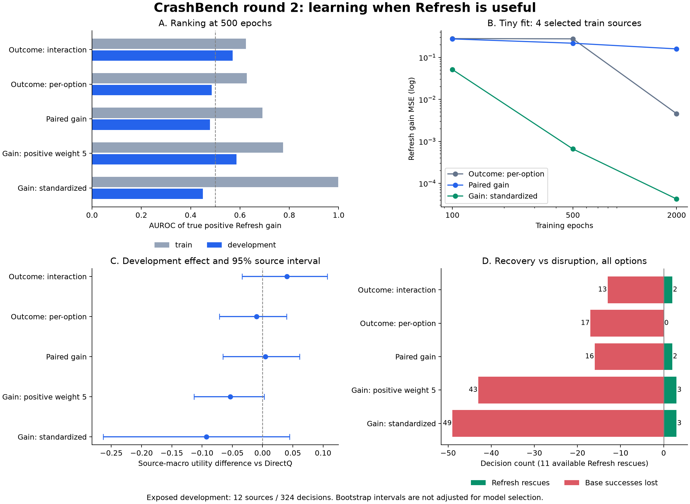

# CrashBench 第二轮：Refresh 收益学习诊断与结果｜2026-09-06

第二轮已完成。现在可以区分三个问题：第一轮的 100 epoch 确实不足以判断真实样本是否可拟合；当前 104-D 特征支持很强的训练集拟合，却没有显示稳定的跨源收益排序；把 Refresh 和 Stop 混在同一次选择中，还会掩盖任务恢复并造成不必要的停止。

有新的恢复信号，但不能宣布方法成功：在只允许 Base/Refresh 的离线开发评价中，标准化收益模型选中 6/11 个真实成功恢复分支，保留原有 221 个 Base 成功，完成率由 68.21% 升到 70.06%；同时新增 2 次事故，121 次 Refresh 中存在大量无益调用，效用增量的源级区间跨零。

执行分支 `codex/refresh-gain-round2`；代码提交 `ff233e364e8f708f77a3a192f0a0f8db6257ec23`。Quest 作业 `5627906`，`COMPLETED`、退出码 `0:0`，耗时 **2 分 7 秒**，2 个 CPU 核，峰值内存约 455 MiB。本轮没有新 rollout、GPU 训练、D8 选择或校准参数搜索。

## 1. 固定实验与验证

依据[事前计划](PLAN.md)，在相同 D5 数据与 104-D 缓存上比较：原修复后的 interaction / per-option outcome 模型；直接预测 Refresh、Stop 相对 Base 收益的 MLP；正收益样本固定权重 5 的消融；仅用 train 统计量标准化输入、替代 LayerNorm 的消融。

24 个 train source、648 个 train 决策；12 个 development source、324 个开发决策。每决策有 Base、Refresh、Stop 三条已执行的反事实分支。五组配置各训练 seeds 0–4 至 500 epoch，完整保留 100/500 epoch 读数；小样本诊断为三个模型、一个 seed、四个训练源的全部 108 个决策，保留 100/500/2000 epoch 读数。

小样本源按事前的 train 标签规则选出：各源既有真正任务恢复又有无益 Refresh。这是刻意选择的工程拟合试验，不能当作泛化证据。全数据模型没有使用这一步来筛除困难源。

**534 项全仓测试通过**；完整 smoke、仓库审计、Shell 语法和 diff 检查通过。取回后验证了 **129 个输出文件哈希、28 个模型、20 组角色级读数重放**，并从输入重新计算所有标准化模型的训练均值/标准差，确认没有使用开发源。原第一轮结果保留。

## 2. 训练数据能不能学会？能，但不能只看 100 epoch

四源工程小集共有 5 个正 Refresh 收益状态，其中 4 个能把 Base 的未成功变成任务成功。

| 模型 | 100 epoch 收益 MSE | 500 epoch 收益 MSE | 2000 epoch 收益 MSE | 2000 epoch 恢复成功机会找回 |
|---|---:|---:|---:|---:|
| Per-option outcome | 0.28008 | 0.27635 | 0.00456 | 4/4 |
| 直接收益，LayerNorm | 0.27503 | 0.21736 | 0.15922 | 3/4 |
| 直接收益，训练标准化 | 0.05126 | 0.00066 | **0.000042** | **4/4** |

标准化收益模型在 2000 epoch 正确标出这 5 个有益状态，没有把其余 103 个状态判成正收益。Per-option outcome 也能在更长训练后学出恢复；这撤回了“100 epoch 不触发就说明该表达一定不能学真实样本”的过强解释。

标准化同时改变了特征尺度并移除了逐样本 LayerNorm，因此这不是只改变一个标量的纯因果实验。它证明这个具体配置能够利用已有特征拟合训练样本，不能单独证明特征对跨源预测已经充分。

## 3. 第一次恒负主要是结局收益被低估，不是连续成本预测巨大

在完整 train 的 29 个真实正 Refresh 收益状态上，100-epoch per-option ensemble 的平均预测分解为：

```text
终局收益差       +0.017908
连续成本差       −0.000079
固定干预成本     −0.050000
预测净收益       −0.032171
```

这些状态的真实平均净收益约 +1.5567。连续成本预测没有大到足以解释这个缺口；关键是模型几乎没有预测出 Refresh 对终局的差异。固定的 0.05 成本把这个很小的预测终局增益压成负值，是现有效用定义的正常结果。删除成本以制造触发会掩盖收益估计错误，本轮没有这样做。

Interaction 在同一组状态上的预测终局增益也只有约 +0.01054。完整分解包含在[机器报告](evidence/report.json)的 `refresh_gain_decomposition` 中。

## 4. 完整数据：拟合提高不等于跨源排序提高

| 500-epoch 模型 | Train Refresh 收益 AUROC | Development AUROC |
|---|---:|---:|
| Outcome interaction | 0.625 | 0.570 |
| Outcome per-option | 0.628 | 0.485 |
| 直接收益，LayerNorm | 0.691 | 0.478 |
| 直接收益，正样本权重 5 | 0.775 | 0.586 |
| 直接收益，训练标准化 | **0.998** | **0.449** |

这是决策级排序诊断，不将相关的决策当作独立检验样本。标准化模型训练排序很强，开发排序接近随机；证据支持该配置存在明显的训练—开发差距。不能仅凭这个表断定唯一原因是样本量、特征缺失或过拟合到某一种具体背景。

额外检查没有发现标准化造成明显的开发输入数值爆炸：绝对标准化值最大为 train 8.61、development 6.60；有 1 个常量维度使用了事前规定的 1e-6 floor。这项检查不排除更细的分布差异。

## 5. 允许三个选项时的主结果

所有结果都是五种子平均预测后选择。效用、完成率和事故率为 source-macro；恢复数及成功损失为决策计数。没有按开发成绩只保留一个 epoch。

| 模型 | U0：100 epoch | U0：500 epoch | 500 epoch 完成率 | 500 epoch 事故率 | Refresh 恢复数 / 11 | 原 Base 成功损失数 |
|---|---:|---:|---:|---:|---:|---:|
| Outcome interaction | 0.3849 | **0.4370** | 64.81% | 4.32% | 2 | 13 |
| Outcome per-option | 0.4144 | 0.3866 | 62.96% | 5.86% | 0 | 17 |
| 直接收益，LayerNorm | 0.3892 | 0.4015 | 63.89% | 5.56% | 2 | 16 |
| 直接收益，正样本权重 5 | 0.3427 | 0.3433 | 55.86% | 2.16% | 3 | 43 |
| 直接收益，训练标准化 | 0.3480 | 0.3036 | 54.01% | 4.01% | 3 | 49 |

基线：Base U0=0.3932、完成率 68.21%、事故率 9.88%；DirectQ U0=0.3965、完成率 65.12%、事故率 6.79%。已知结果的诊断 Oracle U0=0.6048、完成率 71.60%、事故率 0。

500-epoch interaction 相对 DirectQ 的效用差 **+0.04043**，12-source paired bootstrap 95% 区间 **[−0.03359, +0.10716]**，仍跨零。五个 seed 的单模型效用分别约 0.4375、0.4194、0.3942、0.4234、0.4247；它们是优化重复，不是额外独立环境。

这个较高的效用主要伴随事故减少，完成率仍低于 Base。它选择了 58 次 Refresh、40 次 Stop，找回 2 次成功恢复，却损失 13 个原 Base 成功，不能表述为全面提升任务恢复。

## 6. 分开 Stop 后，能看到具体恢复，也能看到新的风险

只允许 Base/Refresh 的预定消融保留同一模型预测，不重新训练或改阈值。DirectQ 也按同样受限选项评价，U0=0.3852。

| 500-epoch 模型，Base/Refresh 模式 | U0 | 完成率 | 事故率 | 恢复数 / 11 | 原 Base 成功损失 | 新增事故数* |
|---|---:|---:|---:|---:|---:|---:|
| Outcome interaction | **0.4151** | 69.14% | 8.64% | 3 | 0 | 1 |
| Outcome per-option | 0.3760 | 66.98% | 9.26% | 1 | 5 | 1 |
| 直接收益，LayerNorm | 0.3914 | 67.90% | 8.95% | 3 | 4 | 0 |
| 直接收益，正样本权重 5 | 0.3985 | 68.52% | 7.72% | 7 | 6 | 3 |
| 直接收益，训练标准化 | 0.4030 | **70.06%** | 9.57% | **6** | **0** | 2 |

*“新增事故”指同一状态 Base 不出事故、所选 Refresh 出事故；它与总体事故率不同。避免某些原有事故的同时仍可能引入新事故。

标准化收益模型的 6 次恢复让成功数由 221 变为 227，但它调用了 121 次 Refresh，选择性仍然很弱。相对 Base 的效用增量只有 +0.00976，95% source 区间 [−0.02060, +0.03828]。Interaction 的对应效用增量 +0.02189，区间 [−0.00996, +0.05306]。这些事后辅助比较仍按开发诊断解释。

固定正样本权重 5 也说明了过度干预的代价：100 epoch 的 Base/Refresh 模式几乎总是 Refresh，找回全部 11 次恢复机会，却新增 6 次事故，效用只有 0.3829；恢复召回高不能独立作为成功结论。

所以值得保留的信号是：已有数据中的真实恢复分支可以被模型选中；需要解决的是更准确地区分何时值得 Refresh，以及 Stop 为什么抢走恢复选择、破坏正常任务。尚未取得可部署的选择器或可靠安全保证。

## 7. 时序输入可用性与下一步边界

核对了 `collect_staleness_statewise.py` 的特征导出：它保存的是 `delivered_anchor` 图像/状态 blob，并在表中记录 queue hash 与 bundle ID。当前 anchor schema 没有 observation age、历史序列或 chunk progress 字段；该采集器没有把队列内容作为这张训练表的输入导出。

因此不能把 `severity_id`、`condition` 或固定 `anchor_steps` 直接改名成可部署时序特征。若以后要加 age/history，需要明确从原始记录或独立日志得到真实观测字段的办法；只凭现有导出表无法补齐这些信号。本轮没有进行新特征采集或新模拟。

后续最小方向：保持 Base/Refresh 的恢复评价可见，用 source-level cross-fitting 检查收益排序在哪些源失效；优先研究保留正常成功、减少无益 Refresh 和避免新增事故，而不是继续提高全局干预率。Stop 应有独立错误分析。新的可部署视觉/时序信息是否改善泛化，需要另一个记录清楚的比较，不能把这一轮的训练拟合胜利外推成泛化成功。

本轮所有 bootstrap 都以 source 为重采样单位，10,000 次，未校正多模型/多 epoch/重复开发选择。已暴露的 12 个开发源不能承担新的确认性主张。

## 图与证据



- [完整机器报告：两档 epoch、全部种子、各源结果和模式](evidence/report.json)
- [执行 manifest 与输入哈希](evidence/run_manifest.json)
- [129 个运行文件哈希](evidence/output_sha256.json)
- [结果完整性、source 与标准化验证](validation.json)
- [可复核绘图脚本](render_results.py)、[结果重放检查脚本](verify_results.py)、[SVG 图](comparison.svg)

完整模型与预测留在本地及 Quest 的 `results/repair_round2/ff233e364e8f_5627906/`。本报告及经核对的机器证据入库，实验输出目录保持忽略。第一轮与更早的所有冻结结果未改动。
