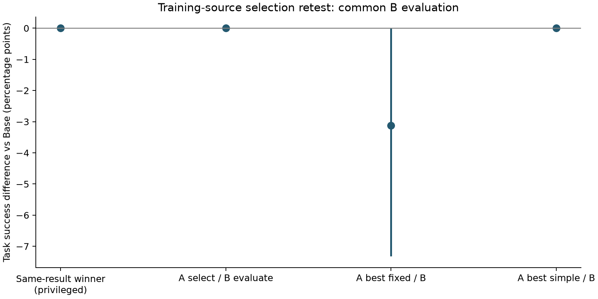

# 训练来源选择收益复验

本轮已完成。核心结论是：**这组训练来源面板没有观察到 Refresh 救回任务的收益，
也没有证明状态选择在任务完成上超过简单规则。** 观察到一处可复验的事故代理降低，
但预先声明的周期规则也获得了它。暂不接入更复杂学习头或开启新确认实验。

十二个训练 source、24 个新 bundle、每选项八次，合计 384 条计分分支；
无来源排除、无 D8 访问、无新策略训练。A 和 B 各 192 条分支；
下表每种方法从 B 的 96 个配对机会中选择一个终局。
主结果不可直接与旧 D5 的 68.21% 比较：这不是同一批锚点或同一来源面板。

图中单次事后赢家也没有任务成功提升；因此这轮不是“成功赢家在复验后消失”的证据，
而是本面板没有捕获到成功转换。事后赢家仍是有限执行表上的特权诊断，不是真 Oracle。
A_best_fixed 在 A 中选中 AlwaysRefresh；A_best_simple 在 A 中选中 period10，
均在 B 前冻结。age3 的 B 表现也相同，但不能把它改称 A 选中的最佳规则。

所有方法使用相同 B 重复。区间按任务分层、来源配对重采样。

| 方法 | 成功率 | 相对 Base 差 [95% CI] | 事故率 | 控制成功保持 | 配对救回/损害 | Refresh 次数 | 平均步数 |
|---|---:|---|---:|---:|---:|---:|---:|
| AlwaysRefresh | 63.54% | -3.12 [-7.32, 0.00] pp | 10.42% | 47/48 | 0/3 | 96 | 82.5 |
| Base | 66.67% | 0.00 [0.00, 0.00] pp | 12.50% | 48/48 | 0/0 | 0 | 77.7 |
| age1 | 64.58% | -2.08 [-5.21, 0.00] pp | 9.38% | 48/48 | 0/2 | 48 | 82.6 |
| age3 | 66.67% | 0.00 [0.00, 0.00] pp | 8.33% | 48/48 | 0/0 | 32 | 82.7 |
| age5 | 66.67% | 0.00 [0.00, 0.00] pp | 12.50% | 48/48 | 0/0 | 16 | 79.9 |
| period10 | 66.67% | 0.00 [0.00, 0.00] pp | 8.33% | 48/48 | 0/0 | 32 | 80.4 |
| A_reference | 66.67% | 0.00 [0.00, 0.00] pp | 8.33% | 48/48 | 0/0 | 4 | 80.5 |
| A_best_fixed | 63.54% | -3.12 [-7.32, 0.00] pp | 10.42% | 47/48 | 0/3 | 96 | 82.5 |
| A_best_simple | 66.67% | 0.00 [0.00, 0.00] pp | 8.33% | 48/48 | 0/0 | 32 | 80.4 |
| B_posthoc_single_winner | 66.67% | 0.00 [0.00, 0.00] pp | 8.33% | 48/48 | 0/0 | 4 | 80.5 |

A 参考相对 A 所选简单规则的 B 成功率差：0.00 pp，95% CI [0.00, 0.00]。

**收益来自哪里。** A 参考仅在 b02（task 0、stale、anchor=10、delay=3）选择 Refresh，
理由是事故差而非成功差。该状态 A 中 Base 事故 4/4、Refresh 0/4；
B 中仍是 Base 事故 4/4、Refresh 0/4。然而 B 的四次 Refresh 都以 100 步超时结束，
成功仍是 0/4。它把事故转换成了未完成，不能写成救回四个任务。
全表事故代理由 Base 的 12/96 降至参考的 8/96，边际差 −4.17 pp，
来源 bootstrap 95% CI [−12.50, 0.00]；period10 和 age3 也达到 8/96。

**损害来自哪里。** AlwaysRefresh 在 B 中没有配对救回，有三次配对损害：
b10 stale 的一次新增事故、b11 matched control 的一次新增事故、b12 stale 的一次超时。
其中 b11 在软件语义上应当中性，不能把其单次终局差异直接解释成 Refresh 的稳定因果损害。
它提示残余执行波动仍需纳入评价。不得据此估计统一噪声率或从其他恢复计数中机械扣减。

**仍可保留的改进假设。** 特权 A 参考调用 4 次，周期规则调用 32 次，
两者在本表上的成功和事故相同，留下“更少调用获得相同事故代理结果”的候选方向。
但参考依赖同一状态的 A 执行终局，并非可部署选择器；尚未与调用预算匹配的
强简单规则或 Risk→BestFixed 比较，调用次数也不等于完整运行成本。
因此不能把这个 4 对 32 的差异写成已经成立的学习选择优势。

**不确定性。** 主图中参考与 Base 的零宽差值区间来自每个观测配对的成功差都为零，
经验 bootstrap 无法生成从未观测到的稀有救回事件；它不是总体收益精确等于零的证明。
这里只有两项固定任务内、按事前词典序选择的十二个来源，不能声称代表性总体估计或
未见任务泛化。所有重复恢复同一 continuation，测量的是残余运行波动，
不是另换未来随机流的鲁棒性分布。事故仅是 75 N 协议代理，Refresh 仅是软件队列刷新。
未运行 Risk→BestFixed 或 DirectQ，本轮不支持完整方法优越性主张。

**论文聚焦建议。** 当前能落笔的是“明确执行分布、重复隔离评价，以及事故—完成—成本的拆分”，
不宜声称学习选择救回更多任务。若保留方法主线，下一步先明确可部署、调用预算匹配的
收益命题，并说明要覆盖哪些当前面板未捕获的收益状态；不要靠增加头容量追逐本表分数。
历史候选只能作为独立机制解释组。任何追加采集需另行冻结范围和预算，本轮不自动扩大。

存储中断后 B 分布于两个作业；b17/repeat5 的两选项跨越作业边界。
预声明诊断（仅去掉这对重复）：参考相对简单规则差 0.00 pp，95% CI [0.00, 0.00]。

工程溯源：原作业 5680180（`1dfc604`）在 55:43 因 home 配额耗尽中断；
保留了 A 192 条、B 139 条和一条截断轨迹。产物完整迁到项目存储后，
作业 5695873（`99dc1a9`）在 14:07 正常完成剩余 53 条，未重跑已完成分支。
A 冻结、全部旧完整轨迹、bundle 和 checkpoint 内容哈希在补齐前通过校验。
两作业合计分配用时 69:50；一条未计分的截断尝试另外保留。
本地按 `6527ff4` 的分析代码重算，主统计与 Quest 自动结果逐项完全一致。
含中断点诊断的完整测试为 545 项通过。主图已人工检查排版。

完整数值见 [metrics.json](metrics.json)，小型冻结和终局证据见 [evidence](evidence/)，
采集和恢复约定见 [PLAN.md](PLAN.md) 与 [RECOVERY.md](RECOVERY.md)。
Quest 原始轨迹分别保存在 `/projects/p33100/siosio/crashbench_selection_retest/1dfc6046ae9c_5680180`
与 `/projects/p33100/siosio/crashbench_selection_retest/99dc1a9567e0_5695873`。
