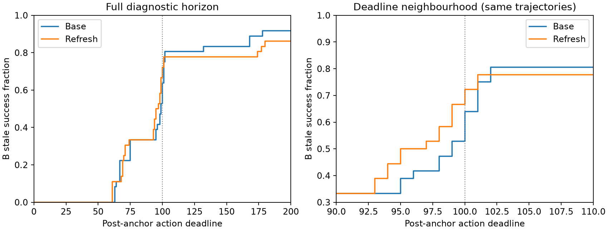

# Refresh 干预的收益测量与选择诊断

本章节汇总已完成的 Refresh 开发线。结论是阶段性收束：当前版本没有建立稳定的任务救回或超越简单规则的学习选择价值；已有数据可形成完整的评估诊断。暂不优先投入架构搜索。该决定不否定所有刷新机制，也不否定任务恢复研究。

## 1. 从单次成功转换到可学习收益

历史 D5 训练记录包含九个 stale 配置的 Base 未成功、Refresh 成功，来自八个物理来源。其中八个 Base 在 100 步内未完成，一个发生事故；四个 Refresh 在 96、96、99、99 步才完成。这样的单次标签同时可能包含完成速度、截止时间截断、事故变化和执行波动，不能直接视为稳定恢复监督。

前期工程审查修复并检查了状态、策略 continuation、观测与来源隔离。同选项重放中曾发现观测及 continuation 相关波动，因此同状态两选项各执行一次不构成稳定期望收益的认证。9/7 的十二来源、384 分支面板中，Base、A 冻结参考和 period10 在 B 都成功 64/96；AlwaysRefresh 为 61/96。该面板未覆盖上述九个旧成功配置，不能据此直接否定旧候选。

随后将九个历史候选全部纳入，并加入九个 matched-buffer 控制配置；没有从候选中再挑最好者。固定 π0、五动作 chunk、Base/一次 Refresh 语义及 75 N 事故代理，每个选项八次，A/B 各四次，总计 288 条分支。每个新锚点保存完整 bundle、队列和 continuation，各分支从同一新 bundle 恢复。旧完整 bundle 不存在，因此这是同来源、同配置的新锚点重建，不是历史状态精确重放。

作业 5753957 在 54 分 40 秒完成 18 个锚点和 288 条分支，无替补或排除。100/200 步终局取自同一条连续轨迹，排除了分别运行两个时域造成的额外差异。matched-buffer 控制按自己的中性条件生成锚点，并不与 stale 锚点共享同一物理状态。

## 2. 双时域结果揭示截止时间效应

B 是原候选机制实验的评价重复。每个条件、每种选项有 36 次 B 执行；统计独立单位仍为八个物理来源。

| 条件和时域 | Base 成功 | Refresh 成功 | 成功率差，百分点 [来源 bootstrap 95% CI] | Base / Refresh 事故 |
|---|---:|---:|---|---:|
| stale，100 步 | 23/36 | 26/36 | +8.3 [−2.8, +19.4] | 0 / 0 |
| stale，200 步 | 33/36 | 31/36 | −5.6 [−13.6, 0.0] | 1 / 1 |
| 中性控制，100 步 | 36/36 | 36/36 | 0 [0, 0] | 0 / 0 |
| 中性控制，200 步 | 36/36 | 36/36 | 0 [0, 0] | 0 / 0 |

100 步有五次正向成功转换、两次反向转换。五次正向转换的 Base 全在第 101–102 步完成；到 102 步，stale Base/Refresh 已分别成功 29/36、28/36。200 步有一次正向、三次反向转换，没有保留总体成功优势。不能重新挑一个有利截止时间作为独立主结果。

这里得到的是有限时域内的机制解释：100 步正向转换主要反映截止时间附近的完成差。200 步仍未成功不能解释成永久失败；新锚点未重复旧收益，也不能证明旧结果全部是噪声。中性控制本轮没有成功损失或事故，但不意味着逐步轨迹完全一致。

## 3. 同状态中存在正负速度作用

| stale 锚点 | B Base / Refresh 完成步数 | 观察 |
|---|---|---|
| b00 | 67 / 61，均四次一致 | 快六步，实际推理调用 14→13 |
| b02 | 63–64 / 68–69 | 慢约 5.5 步，调用 13→14 |
| b04 | 75 / 70–74 | 局部加速 |
| b10 | 100–101 / 98–101 | 差异跨越 100 步边界 |
| b12 | 98–100 / 95–98 | 局部加速 |
| b14 | 95–99 / 93–94 | 局部加速 |
| b16 | 100–102 / 99–101 | 差异跨越 100 步边界 |

这七个锚点在 B 的 200 步两选项都为 4/4 成功；总体评价仍纳入有失败的 b06/b08，不能只算成功子集。b00/b02 同为 task 0、age=1、anchor=15，却呈相反作用，说明 age 本身不完整决定收益。

b06/b08 共享唯一 age=3 来源。b06 的有界完成代价差（Refresh−Base）从 A 的 −52 步变为 B 的 +20.75 步。四次重复的收益均值仍可能明显变化；这些重复测量一个 bundle 下的执行差异，不是独立新锚点。更贴合 A 不自动意味着更准确预测 B。

## 4. 固定收益学习与强简单规则

时间目标是在看到 B 后提出的，因此以下所有学习与规则比较都是开发诊断。八来源 LOSO 将同来源的全部条件、锚点及重复置于同侧；每折仅以其余七来源 A 均值训练，在留出来源 B 评价。模型分别预测有界完成代价、实际调用数、成功和事故的 Refresh−Base 差。

有界完成代价定义为成功时的完成步数，200 步未成功统一记 200；提前事故不能被算作加速。两输入版本复用相同 Ridge α=1：元信息为任务/软件 age/已执行步数；观察版本加入已交付相机的固定 4×4 RGB 池化和 proprio。预处理仅拟合训练侧，来源总权重相同。仅在预测两项成本都下降、成功与事故不恶化时刷新。点预测门不构成安全保证。

未使用 fresh 图像、未来信息或额外推理获得的动作。所有锚点的 action chunk 为空，因此没有可用 nominal proposal。实际调用数来自记录，不把一次 Refresh 机械地记作一次额外 VLA 调用。

下表对全部 stale/控制、八来源等权。原始 Base 成功为 69/72，两种 Ridge 均为 67/72。

| 方法 | 完成代价差 | 实际调用差 | 成功率 | 新增事故数 |
|---|---:|---:|---:|---:|
| Base | 0 | 0 | 97.66% | 0 |
| AlwaysRefresh | +0.727 | +0.281 | 96.09% | 1 |
| age≥1 | +0.664 | +0.242 | 96.09% | 1 |
| age≥3 | +1.477 | +0.383 | 96.09% | 1 |
| age≥5（本组不触发） | 0 | 0 | 97.66% | 0 |
| period10 | −0.266 | −0.031 | 97.66% | 0 |
| age=1，开发规则 | −0.813 | −0.141 | 97.66% | 0 |
| 元信息 Ridge | +0.883 | +0.273 | 96.09% | 1 |
| 观察 Ridge | +1.102 | +0.320 | 96.09% | 1 |

age=1 相对 Base 节省约 **0.935% 有界完成代价、0.797% 实际调用**。该规则根据已暴露严重度模式提出，其小幅代理指标收益不能承担新的方法主线，也未证明真实机器人端到端加速。模型在加入自身开销前已更差；本机预热 CPU 选择开销约为元信息 0.0044 ms、观察 1.21 ms，并非机器人运行时测量。

两种 Ridge 都发生三次原有成功损失、一次正向成功转换。事故总数仍为一次，但原事故消失、另一处新增事故，必须分别报告，不能用净数相等声称没有新风险。

## 5. 来源支持和选择误差是两个问题

留出唯一 age=3 来源时，仅剩 14 个训练锚点，成功差与事故差标签全部为零。风险头输出零反映未见过相应后果，不能解释成已验证没有风险。这首先是训练支持之外的外推；重复优化或增加同类样本数量不能自动补足这种机制覆盖。

另一问题是收益方向识别：元信息模型将 b00/b02 都刷新；观察模型将两者都保留 Base，避开减速却漏掉加速。粗图像表示的失败不能推广成所有观察信息都无用，但当前模型没有学出需要的相反选择。

为区分两者，本次只做一个纯事后覆盖诊断：将困难来源上的选择全部置为 Base，其他选择不变，仍对八来源完整计分。没有重新训练，没有删除困难来源，没有把来源身份变成部署规则。

| 模型 | 原完成代价差 | 事后强制困难来源保留 Base |
|---|---:|---:|
| 元信息 Ridge | +0.883 | −0.594 |
| 观察 Ridge | +1.102 | −0.375 |
| age=1 规则，参照 | −0.813 | 不改动 |

即使理想地避开该来源，两种模型仍未超过简单规则。这不是可部署的新方法或安全上界，只表明单独修复“不熟悉就别刷新”尚不足以解决现有收益选择缺口。

## 6. 阶段结论与研究边界

完成的证据链为：单次成功转换 → 同状态重复与双时域检查 → 截止时间效应和局部正负速度作用 → 简单规则小幅获益 → 来源隔离学习未建立额外价值。它可以作为完整的干预评估诊断章节，不需要包装成方法成功。

本版本 Refresh 开发线到此阶段性收束。保留原始轨迹、bundle、输入哈希、冻结选择、来源划分及全部正负结果；不覆盖旧报告，不自动增加 rollout、架构、阈值或新来源。未来若有新的机制、可部署信息或明确补足来源支持的理由，可另立开发方案，不能把这次收束解释为整个恢复方向失败。

下一份方案回到“选择能完成任务的恢复干预”，以固定恢复选项和固定 choice 配方研究 benefit gate。历史 oracle 分解只提供问题定位，不提供可部署方法承诺。

## 7. 可复核证据入口

- [工程调查与全面审查](../../20260906/paper_review/COMPREHENSIVE_REPORT_ZH.md)：观测与 continuation 诊断。
- [384 分支复验](../../20260907/selection_retest/RESULTS_ZH.md)：未覆盖旧成功配置的独立训练面板。
- [288 分支双时域报告](../candidate_refresh/RESULTS_ZH.md)：机制结果和 Quest 原始位置。
- [直接收益学习报告](../direct_cost_learning/RESULTS_ZH.md)、[冻结模型](../direct_cost_learning/run_v1/freeze.json)、[逐来源数据](../direct_cost_learning/per_source.csv)。
- [本次新增复算](reproduce.py)、[机器证据](evidence/evidence.json)：14 锚点零风险差、事后覆盖、A/B 变化、相对收益和完整截止曲线。
- [后续 benefit-gate 方案](BENEFIT_GATE_PLAN_ZH.md)：仅规划，尚未执行。

所有候选来自历史成功筛选，只有八个独立来源。新目标提出后 B 已暴露；LOSO 的训练集也彼此重叠。不得把这些结果称为总体效果估计、独立确认、永久失败救回或真实机器人加速认证。
