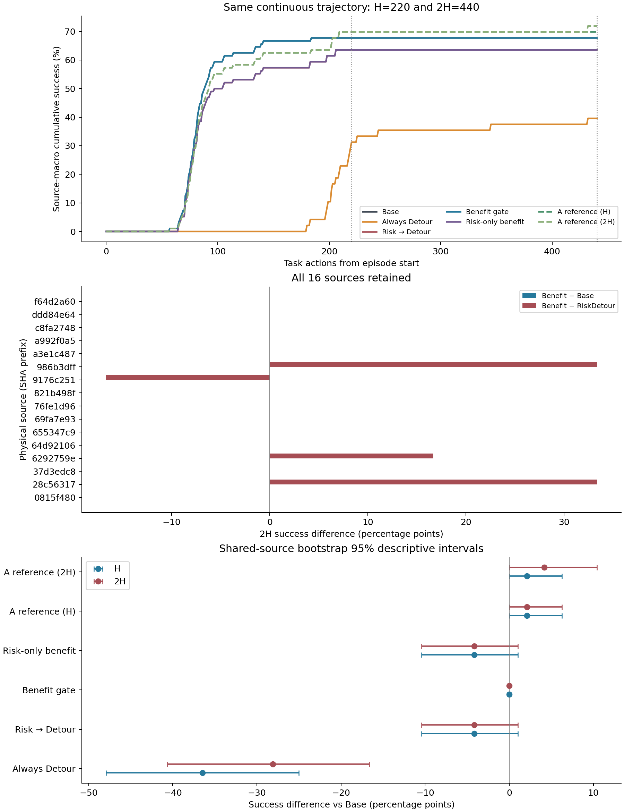

# 固定 Detour 收益与门控：完整开发实验报告

**结论：固定 Detour 在两个 glass 锚点上呈现跨 A/B 重复的任务救回，但总体接管显著损失正常任务成功。本轮全输入收益 gate 退回全 Base，没有建立相对 Base 的额外任务收益，也没有形成足以进入新来源验证的学习选择证据。** 这不是所有恢复机制或所有执行前信息的永久否定。

本报告基于真正完成的开发实验及独立核验。主作业5791132：COMPLETED，1:57:42，exit0:0；只读重复轨迹作业5804513：COMPLETED，1:03，exit0:0。48条前缀、47个候选、376条分支；没有超出48/384上限，没有新确认实验，没有修改D8或历史冻结结果。

## 1. 实际资产、协议与测量边界

原 capture d4751330395e 的四项原文件在本地和Quest均找到，全部匹配冻结resolver哈希。完整旧glass bundle没有在该capture目录保存，因此本次是同物理来源的新锚点，不是旧状态精确重放。27个历史物理来源文件均通过状态哈希校验；本轮按预先规则选16个，来源与条件清单见[development_sources.csv](development_sources.csv)。旧清单已有hazard screening，不能称无偏的新来源样本。

Backbone固定OpenVLA spatial，revision `962318cec55ac10993ff0f5f43eda9a270b4c873`，四个权重分片字节哈希已在计算节点核验。DetourComplete类源码与历史版本逐字节相同，类SHA-256为 `b75171f18daa60bca9ce0694d37eb81f2743b5d350b8aba84be9d775d3a51a99`。它使用glass位置/尺寸、碗盘位置及搬运偏移等特权几何；no-glass也使用虚拟on-path几何。不能表述为纯视觉机器人部署能力。完整身份见[资产审计](asset_audit.md)、[控制器身份](controller_identity.json)和[evidence/checkpoint_hashes.json](evidence/checkpoint_hashes.json)。

旧风险模型使用过的12个来源全部留在fitting侧；其余来源按固定身份哈希选择4个calibration来源，每来源取字典序第一个placement。没有按Detour恢复成功选择。所有同源条件、锚点和重复保持同侧。

候选：在原本的OpenVLA调用产生当前hidden/state/action之后，首次风险分数严格超过0.3072859857738742；只允许任务动作0–219前触发一次。阈值所用历史7个校准来源现全部位于fitting侧。实际47个候选的锚点动作索引范围0–58，中位12；候选生成很宽，并不意味着最终gate干预率高。

Base执行已经生成的pending proposal后继续；R丢弃该proposal，运行原Detour legs，若任务尚未终止则恢复Base。拒绝后不再提供第二次候选。原OpenVLA没有五动作chunk：当前proposal已执行0、待执行1、其后队列0。每个新锚点保存环境XML、状态、controller runtime、policy continuation、RNG、缓存、输入上下文和proposal；所有分支从该bundle恢复。

H=220、2H=440按episode任务动作时钟计数，前缀与控制器动作都入账，settle10另记；环境实际支持所需长预算。H/2H由同一连续轨迹读出，未在H重置或额外推理。事故优先于同时成功，事故为竞争终局；事故谓词沿用glass倾倒/位移/接触力协议，不是所有机器人接触风险的指标。

A两次同bundle同RNG用于运行时诊断；B两次恢复同bundle后仅覆盖torch策略种子20270902/20270903，同repeat两臂配对，执行顺序交替。解码保持greedy，不把新种子解释为非退化随机策略分布的新抽样。A/B隔离不等于来源隔离。

## 2. 完整执行、分母与冻结检查

每侧A/B各188条分支，分别包含94条Base和94条R。e46（calibration、offpath）在候选出现前发生协议事故，作为一个共享前缀终局保留，没有虚构8条分支补满预算。无触发比例2.08%，本轮全部来自该早事故；47个继续执行的episode均出现候选。

模型、scaler、PCA仅用fitting侧A；36个有效训练锚点、中心化hidden秩35，支持预先固定的PCA4。没有增大维数或用重复帧补秩。Ridge alpha=1，来源总权重相等，预测H和2H的成功差、事故差。部署gate预先以H成功为校准主目标，同时约束两预算事故变化和正常保持；**没有另外训练或校准一套以2H为主目标的部署gate**。因此当前失败不能外推为所有长预算门控均无信号。

已校验A、anchors、models和freeze哈希，并在本地仅用A独立重现全部冻结选择。B用于评价，没有用于重选阈值。主脚本也核验了每个bundle和轨迹文件哈希；附加CPU分析比较188对同选项重复。

下表先按episode内重复平均，再按每来源三个条件平均，最后对16来源等权。共享早终局只保留一份观测，不将百分比的等效分母当作实际执行重复数。

## 3. 主比较：任务成功与事故分开报告

|预算|方法|成功率|相对Base成功差 [描述性95%区间]，pp|事故率|事故差，pp|干预率|
|---:|---|---:|---|---:|---:|---:|
|220|Base|67.71%|+0.00 [+0.00, +0.00]|26.04%|+0.00|0.00%|
|220|候选均 Detour|31.25%|-36.46 [-47.92, -25.00]|10.42%|-15.62|97.92%|
|220|强 Risk→Detour|63.54%|-4.17 [-10.42, +1.04]|22.92%|-3.12|14.58%|
|220|DirectQ（等价核验）|67.71%|+0.00 [+0.00, +0.00]|26.04%|+0.00|0.00%|
|220|全输入 benefit gate|67.71%|+0.00 [+0.00, +0.00]|26.04%|+0.00|0.00%|
|220|仅风险分数 benefit|63.54%|-4.17 [-10.42, +1.04]|22.92%|-3.12|14.58%|
|220|A-H 参考（诊断）|69.79%|+2.08 [+0.00, +6.25]|23.96%|-2.08|6.25%|
|220|A-2H 参考（诊断）|69.79%|+2.08 [+0.00, +6.25]|21.88%|-4.17|8.33%|
|440|Base|67.71%|+0.00 [+0.00, +0.00]|26.04%|+0.00|0.00%|
|440|候选均 Detour|39.58%|-28.12 [-40.62, -16.67]|14.58%|-11.46|97.92%|
|440|强 Risk→Detour|63.54%|-4.17 [-10.42, +1.04]|22.92%|-3.12|14.58%|
|440|DirectQ（等价核验）|67.71%|+0.00 [+0.00, +0.00]|26.04%|+0.00|0.00%|
|440|全输入 benefit gate|67.71%|+0.00 [+0.00, +0.00]|26.04%|+0.00|0.00%|
|440|仅风险分数 benefit|63.54%|-4.17 [-10.42, +1.04]|22.92%|-3.12|14.58%|
|440|A-H 参考（诊断）|69.79%|+2.08 [+0.00, +6.25]|23.96%|-2.08|6.25%|
|440|A-2H 参考（诊断）|71.88%|+4.17 [+0.00, +10.42]|21.88%|-4.17|8.33%|

区间使用5000次共同来源重采样，seed2027，仅作描述。全输入gate与Base选择完全相同，因此其零差值及零区间是策略恒等的结果，不是“已认证安全”。

全输入gate相对强Risk的成功差为+4.17 pp，区间[−1.04,+10.42]；事故差为+3.13 pp，区间[0,+8.33]，两个预算相同。该差异来自退回Base后避免了Risk的成功损失，同时放弃了其事故减少，不能称学习恢复胜利。

DirectQ两臂Ridge与差值Ridge使用相同输入、权重、预处理与正则，预测差最大误差4.09e−14；其选择相同，只是代数核验。Risk-only benefit与强Risk也恰好选择相同7个episode。本轮没有分离出可兑现的监督目标改进或额外输入价值。所有Risk比较都在共同候选机会下，不能写成击败完整from-reset Risk→BestFixed。

## 4. 正常保持、成功损失和新增事故

|方法|H 原成功损失率|2H 原成功损失率|H 新增事故率|2H 新增事故率|2H 正常控制成功率|
|---|---:|---:|---:|---:|---:|
|Base / 全输入gate / DirectQ|0|0|0|0|92.19%|
|候选均Detour|39.58%|33.33%|3.13%|4.17%|46.88%|
|强Risk / risk-only benefit|5.21%|5.21%|0|0|87.50%|
|A-H / A-2H参考|0|0|0|0|92.19%|

损失和新增事故按声明的repeat配对计算，以全部相关episode为分母；不是“在原成功者中的条件损失比例”。它们仅为辅助，边际成功和事故变化是主指标。正常控制单列的成功损失率：候选均Detour为H56.25%、2H46.88%，强Risk为6.25%；不能用总体事故下降掩盖这些损失。

|条件|H Base / 候选均Detour成功|2H Base / 候选均Detour成功|2H强Risk成功|2H A-2H参考成功|
|---|---:|---:|---:|---:|
|on-path glass|18.75% / 18.75%|18.75% / 25.00%|15.63%|31.25%|
|off-path glass|90.63% / 25.00%|90.63% / 43.75%|78.13%|90.63%|
|no-glass|93.75% / 50.00%|93.75% / 50.00%|96.88%|93.75%|

固定Detour确实可在glass中救回部分任务，但总体接管严重损害控制任务。2H下，没有一个来源的“候选均Detour”三条件净成功差为正；局部glass正效应在同源控制条件中可能被抵消。

## 5. 重复和时域：哪些局部效果兑现了

|锚点 / 来源前缀|A成功差 H / 2H|B成功差 H / 2H|诊断|
|---|---:|---:|---|
|e15 / 9176c251，glass|+0.5 / +0.5|0 / 0|A Base一次事故、一次成功；B Base均成功。R各次209步成功，优势消失。|
|e18 / 986b3dff，glass|+1 / +1|+1 / +1|A/B共4次Base均事故，R均202步成功。|
|e21 / a3e1c487，glass|0 / +1|0 / +1|A/B共4次Base均事故，R均432步成功，须长预算才能看到完成。|
|e41 / 6292759e，no-glass|+0.5 / +0.5|0 / 0|A Base一次超时、一次成功；B Base均成功，R均203步成功。|

A-2H参考在A选四个锚点，到B只在e18/e21两物理来源保留正收益。其B总体成功提升4.17 pp，描述性区间[0,10.42]；A-H参考只保留e18的2.08 pp。e18/e21的Base都发生事故，不能解释为Base在H后追上的纯截止速度效应；但4次重复仍不能认证单状态期望效应，且两个点都位于fitting侧。

B另有e17 no-glass +0.5的正向转换，A参考没有选中。不能把这个B新暴露点反加进参考或gate。2H仍是有限预算，未成功不等于永久失败。

同选项终局不一致：Base在47锚点中A有4个、B有6个；R在A/B均0个，H/2H计数相同。轨迹层面差异更多：

|重复对|对数|动作不同|状态不同|策略输入不同|轨迹长度不同|
|---|---:|---:|---:|---:|---:|
|A Base|47|45|45|47|39|
|A R|47|3|3|4|1|
|B Base|47|46|46|47|41|
|B R|47|3|3|4|1|

“终局一致”远弱于“过程一致”。A是同bundle同RNG，仍观察到Base输入和动作分歧，属于需要保留的运行时/观测链差异；不能把全部波动归因于B种子，也不能仅据差异表锁定某个底层原因。逐对首次分歧见[evidence/repeat_trace_diagnostics.csv](evidence/repeat_trace_diagnostics.csv)。

## 6. 为什么收益 gate 全部拒绝

这次不是样本数或PCA秩不足导致的fallback：36个fitting锚点、秩35，固定PCA4正常拟合。全输入模型在e18预测H成功差约+0.266、2H约+0.239；在e21预测H约−0.119、2H约+0.198。因此不能简单说模型完全没有局部信号。

关键缺口在calibration：唯一A正收益e41，在全输入模型中H成功差预测约−0.456，事故差预测约+0.055，未通过预测事故条件；它的正收益到B也消失了。相反，正常失败点e44获得略正的H预测约+0.005，实际A/B都为负收益。校准中没有可接受的正任务增益，按既定平局规则选择无限阈值，即全Base。

Ridge输出是无约束回归差值，不是概率或安全证书；未触发e46的零填充向量仅用于对齐数组，始终被trigger mask排除，不是一个可部署预测。少量校准来源及稀少、波动的正标签限制了阈值识别。这支持优先检查来源支持与测量稳定性，不支持自动换网络。

## 7. 全部来源的2H成功差

每行包含该来源全部三个条件。成功差单位pp；完整SHA、H结果、事故及成本见[evidence/per_source.csv](evidence/per_source.csv)。

|来源前缀|角色|Base成功率|均Detour差|强Risk差|全输入gate差|A-2H参考差|
|---|---|---:|---:|---:|---:|---:|
|0815f480|fitting|66.67|-33.33|0.00|0.00|0.00|
|28c56317|fitting|100.00|-33.33|-33.33|0.00|0.00|
|37d3edc8|calibration|66.67|-33.33|0.00|0.00|0.00|
|6292759e|calibration|83.33|-16.67|-16.67|0.00|0.00|
|64d92106|calibration|16.67|-16.67|0.00|0.00|0.00|
|655347c9|calibration|66.67|-66.67|0.00|0.00|0.00|
|69fa7e93|fitting|66.67|0.00|0.00|0.00|0.00|
|76fe1d96|fitting|83.33|-50.00|0.00|0.00|0.00|
|821b498f|fitting|66.67|-66.67|0.00|0.00|0.00|
|9176c251|fitting|66.67|0.00|16.67|0.00|0.00|
|986b3dff|fitting|66.67|0.00|-33.33|0.00|33.33|
|a3e1c487|fitting|66.67|0.00|0.00|0.00|33.33|
|a992f0a5|fitting|66.67|-66.67|0.00|0.00|0.00|
|c8fa2748|fitting|66.67|-33.33|0.00|0.00|0.00|
|ddd84e64|fitting|66.67|0.00|0.00|0.00|0.00|
|f64d2a60|fitting|66.67|-33.33|0.00|0.00|0.00|

## 8. 实际成本与质量检查

真实VLA调用17553次：前缀798次，分支新增16755次。候选风险调用798次，共约0.095秒；全部47个候选已付出的nominal proposal在R侧即使丢弃也计入成本。

2H每episode来源等权调用：Base/全输入gate97.76，候选均Detour26.78，强Risk84.64。但均Detour的有界完成成本从Base200.04增至355.60动作，成功也显著减少。减少VLA调用不能包装成更快完成任务。控制器动作数、提前失败的完整预算代价均单独记录。

全输入gate预热CPU投影/scaler/Ridge中位约0.018 ms，risk-only约0.010 ms；拟合及校准约0.108秒。这些不含VLA，也不是实物机器人端到端延迟。实际前缀墙钟303.27秒、分支6167.14秒；主作业总7062秒包含初始化、权重哈希、I/O和分析，约1.962 A100 GPU小时，MaxRSS约18.0 GiB。额外只读CPU诊断63秒，新增轨迹0。188条R分支中16条实际走到恢复Base，其余在此前已任务终止或预算耗尽；已成功时无需强行恢复。

已覆盖无触发、早成功/事故、同一步事故优先、连续H/2H读出、控制器耗时入账、pending队列恢复、A/B标签检查、来源跨条件隔离、失败不算加速和DirectQ等价；相关回归测试166项通过，本轮扩展专项11项通过。测试及执行成功仅证明流程通过，不是方法成功。

## 9. 去留判断与下一步边界

本轮不进入自动新来源验证。两个来源存在重复中保留的局部救回，但四点A参考只兑现两点；全输入gate没有超过Base，risk-only也没有超过强Risk。相对强Risk的成功优势来自全Base，并伴随事故增加。故没有满足“稳定多来源任务收益且gate有额外决策价值”的组合要求。

合理结论是：保留局部机制证据、完整披露正常任务损失和Base运行时波动；将校准正效应支持不足及H主目标/长预算收益的不一致列为后续可区分假设。若另行申请预算，应先明确要检验测量波动、校准支持还是长预算目标，而非自动换网络、制造负例或加来源。现有数据已暴露，不再用B调阈值。

## 10. 可复核交付

- [主表](evidence/overall.csv)、[与Base/Risk/DirectQ配对比较](evidence/paired_comparisons.csv)、[全部来源条件](evidence/all_episode_conditions.csv)。
- [752条双预算终局记录](evidence/all_terminal_records.csv)对应376条真实分支；[共享早终局](evidence/shared_prefix_outcomes.json)保留未触发episode。
- [A/B重复诊断](evidence/repeat_diagnostics.csv)、[188对轨迹诊断](evidence/repeat_trace_diagnostics.csv)、[完整0–440成功累计曲线](evidence/success_cumulative_curve.csv)。
- [固定协议](PLAN.md)、[执行配置](../../../../configs/detour_benefit/development_v1.json)、[来源表](development_sources.csv)、[执行记录](RUN.md)、[冻结选择](evidence/freeze.json)、[成本及机器诊断](evidence/metrics.json)。
- 原始bundle和逐步轨迹保留于Quest `/projects/p33100/siosio/crashbench_detour_benefit/a89f755da200_job5791132`；本地`results/detour_benefit/a89f755da200_job5791132`保存取回的终局、冻结元数据与分析。旧数据未重建或覆盖。
- 主执行提交`a89f755da200c853795e429b5ae34944a08f915f`；只读轨迹核验提交`e74a5149536a36860f5c8aa4c2405d287efa08f4`。
