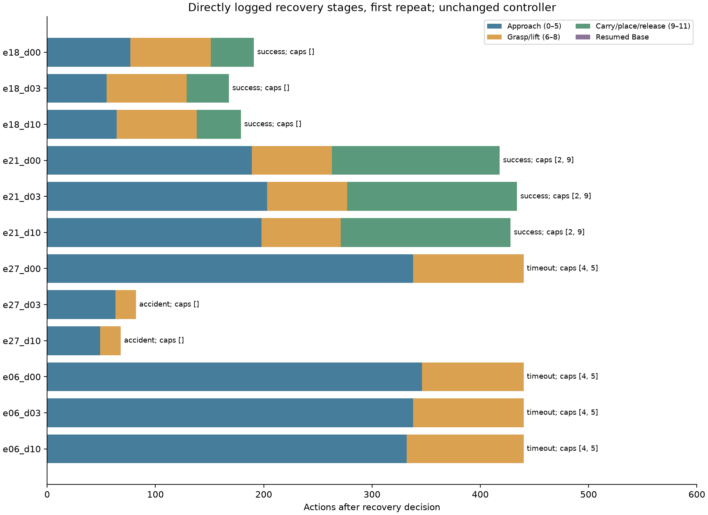
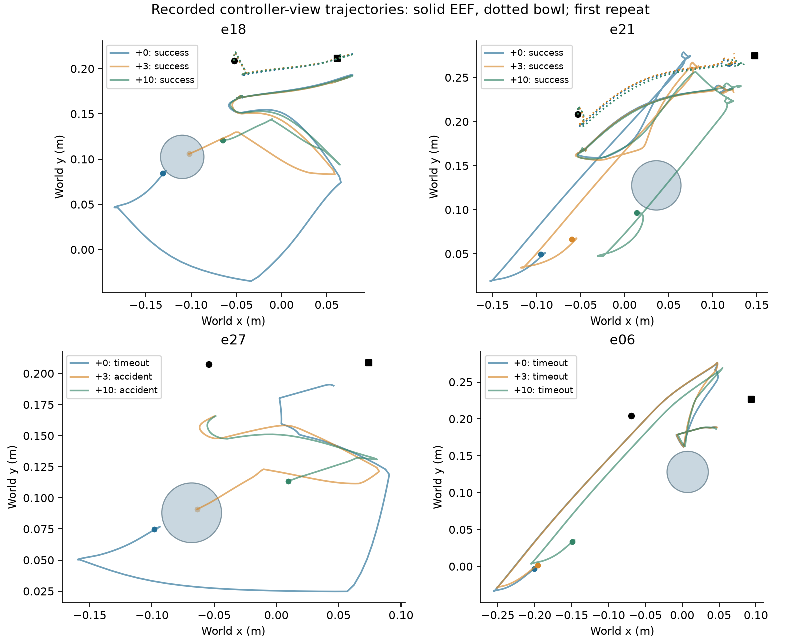

# 从 e18/e21 出发的 recoverability 微型实验

**结论：固定 Detour 的正例在局部状态推进下重复成立，但本轮没有把失败对照变成新的可恢复状态。** 值得保留的线索是“能否安全建立抓取并搬运物体”这一阶段差异；目前还没有可部署的执行前物理判别规则，更没有“物理上无解”的证明。这轮支持机制诊断，尚不支持扩大模型或宣布论文方法成立。

## 实际完成了什么

Quest 作业 **5809503**，执行提交 `cebbe3445a9151930bf7b54e04689bb695f5ccb9`，23分10秒，COMPLETED / exit0。四个已暴露 fitting 来源 e18/e21/e27/e06，每来源从原完整 bundle 实际执行 Base 0/3/10 步生成三个子状态；每个子状态恢复同一 bundle，执行 Base / 固定 Detour 各两次。全部12个子状态可用，**48条计分分支、4条前缀、40个新增前缀动作**，没有补充来源、训练模型、改动控制器或访问D8。

对照在结果揭示前固定：按米制相对位置及玻璃尺寸距离，从旧A失败 fitting glass 中为 e18/e21 贪心选择两个不同的最近邻，得到 e27/e06；没有根据新结果挑对照或更改0/3/10时点。完整选择规则和输入哈希见 [冻结配置](../../../../configs/recoverability/probe_v1.json) 与 [方案](PLAN.md)。这些是选择过的开发案例，不能当总体随机样本。

每个新决策状态拥有相同的后续220/440动作预算，同时保留历史绝对episode第220/440步读出。两种读出来自同一连续轨迹，没有中途重置；干预动作计入预算，事故优先。此处后续预算是新诊断，未改写旧实验的绝对预算结果。

## 全部结果

下表每项均为两次重复。B/R分别为Base/Detour；“成功/事故”以统一后续440步为准；其余为超时。R成功步数从子状态决策时刻计算，两次一致。

|父来源|Base推进步数|B成功/事故|R成功/事故|成功差|R成功所需后续步数|
|---|---:|---:|---:|---:|---:|
|e18|0|0/1|2/0|+100pp|191|
|e18|3|1/1|2/0|+50pp|168|
|e18|10|2/0|2/0|0pp|179|
|e21|0|0/1|2/0|+100pp|418|
|e21|3|0/0|2/0|+100pp|434|
|e21|10|0/1|2/0|+100pp|428|
|e27|0|0/2|0/0|0pp|—|
|e27|3|0/2|0/2|0pp|—|
|e27|10|0/2|0/2|0pp|—|
|e06|0|0/2|0/0|0pp|—|
|e06|3|0/2|0/0|0pp|—|
|e06|10|0/2|0/0|0pp|—|

后续220步时，R只有e18三个子状态成功；e21均未完成。全部H/2H终局见 [terminals.csv](evidence/terminals.csv)，所有0–440步的累计成功/事故读出见 [cumulative_curves.csv](evidence/cumulative_curves.csv)，每个状态的边际结果见 [cells.csv](evidence/cells.csv)。不以本表选最有利截止点，也不将48分支当48物理来源。

三个关键区分：

1. **可恢复性保持，但必要性改变。** e18三个子状态均为R两次成功；推进10步后Base也两次成功，不能把该状态继续称为“新增救回”。新Base重复还出现成功/事故或事故/超时分歧；旧四次Base事故没有保证新进程重跑完全一样。
2. **e21对绝对截止敏感。** 三个子状态R的绝对成功步数为432、451、452。按旧绝对440截止，后两个变成失败；按统一后续440预算则均成功。这是预算截断造成的标签翻转，不是恢复能力消失。统一后续220也不足以完成，不能抹去其慢恢复代价。
3. **未产生新的失败→成功状态。** e27原锚点即使获得完整后续440步（绝对到498）仍超时，排除了本次延长到498就能解决的解释；推进后改为下降阶段事故。e06三个时点均超时。不能据此外推更长预算或其他控制器也一定失败。

## 物理区别：抓取前的跟踪障碍与安全下降

以下证据来自运行时直接记录的控制器输入、阶段和物体位置，不是重建出来的阶段。阶段编号固定：4预抓取、5抓取XY、6下降、7闭合保持、8抬起、9搬运、10放置。

- **e18：** 三个时点均无阶段上限退出。预抓取/抓取XY误差降至约1.6–1.9cm，随后完成下降、抓取、抬起和搬运。记录中碗最大抬升约30cm，XY位移约13cm。
- **e21：** 三个时点均在侧向通道阶段2和搬运阶段9耗尽140动作上限，却仍完成任务。抓取前误差能够降至约1.5–1.9cm，碗实际抬升约30cm、XY位移约19cm。因此“任何阶段达到cap”不是不可恢复判据，必须看发生在哪个阶段以及后续是否真正操作了物体。
- **e27，推进0步：** 阶段4/5分别耗尽140动作，退出误差约6.5/6.2cm；随后停留在下降阶段至预算结束，碗未出现可见于该记录精度的抬升或XY移动。
- **e27，推进3/10步：** 抓取前两个目标现在能够到达，但下降阶段分别在第82/68个后续动作触发事故，尚未形成搬运。改善目标跟踪没有改善安全任务完成，反而失去原先的零事故超时结果。
- **e06：** 三个时点均在阶段4/5耗尽上限，退出误差约6.0–6.9cm，碗基本不动。接近目标一些并未解除这一阶段障碍。

图展示第一次重复；第二次R的两时域终局与阶段上限模式相同。路径为每步动作执行前的观测，最后一次动作后的状态未包含在这张图中；圆是控制器使用的**预设玻璃几何**，并非已验证的动态玻璃实测轨迹。XY投影跨过圆不等于三维碰撞。原始观测和逐阶段表保留在证据中。

这支持一个更具体的研究假说：固定技能的任务恢复需要同时满足“进入有效抓取状态”和“沿安全的下降/搬运路径完成操作”。单纯更接近碗、单纯避险或单纯减少控制器跟踪误差都不充分。e18与e27初始EEF到碗XY距离约14.7/14.0cm、到预设玻璃距离约2.8/3.3cm，却有不同结果；粗距离相似不等于操作状态相似。**这些阶段指标含执行后信息，只能解释，不能直接作为执行前gate特征。**

尚未分离造成跟踪障碍的关节构型、接触、姿态或控制器目标因素。沿Base推进同时改变多个状态量，本实验不能把某一个距离或角度写成已识别的因果原因；也没有独立接触力/运动学证书来证明失败状态在物理上无解。

## 重复、成本与可信范围

12个R子状态两次后续440终局读出完全一致；Base有10/12子状态的完整读出不一致（其中一些只差终止时间）。这里的两次是同bundle、同恢复RNG的运行时诊断，OpenVLA仍为greedy；不是两个新的独立物理来源，也不是对随机策略分布的认证。e18/e21的新d0 R完成步数复现旧结果，但Base事故频率不同，干预收益不能简单沿用旧Base标签。

计分分支共执行10,803动作，其中7,456为控制器动作。分支计账调用数为B 3,347、R 24；R的24次是共同候选proposal成本，R丢弃proposal后本轮均在控制器内终止，未恢复Base。扣除48次复用候选proposal、加40次子状态生成中的实际推理，本作业新策略推理为3,363次。分支循环墙时B合计880.29秒、R合计199.95秒，前缀生成14.39秒；整个Slurm作业1,390秒，还包含加载、权重核验、保存等。恢复、哈希和bundle读取不全包含在branch循环墙时中，不能拿循环时间冒充全部成本。本轮没有学习gate，gate开销不适用；未单独隔离日志开销。详见 [costs.csv](evidence/costs.csv)。提前事故虽少执行动作，不计为任务加速。

历史轨迹的只读FK重建作业5808426在14秒后因缓存EEF观测与新forward结果不一致而失败，没有执行新轨迹，也没有采用推断阶段。本轮直接记录绕开了这项测量不确定性，但没有把旧FK差异解释为已修复。搬运阶段首步会在控制器内部调整目标，故cap判定另外要求实际计数达到140，不把首步旧目标误差误计为cap。

16项相关单元测试通过，含控制器日志不改动作、统一后续预算读出与候选不可用保留。测试通过和作业成功只是实施质量；科学结论来自终局及物理证据。四个选择过的旧来源、每格两重复不足以支持总体置信声明，本报告展示完整逐来源结果，不提供有误导性的总体显著性或安全保证。

## 论文判断与下一步

本轮的“能否产生更多recoverable states”答案是：**未找到。** 从已经失败的两个父来源生成的四个新时点，没有一个转为R成功。因此原先“值得一个非常小实验”的判断已兑现，但没有得到继续扩规模的正证据。

真正值得保留的论文问题是：**安全抓取可达性与后续搬运能力如何共同限制固定技能的任务恢复，而这种限制能否在执行前验证？** 当前只能给出阶段证据，尚不能宣称已找到稳定的物理分界面或有效的状态生成器。尤其e27表明，解除前段跟踪障碍可能把失败模式从超时变成事故。

相关工作已经覆盖恢复benchmark、反事实失败数据生成、recoverability选择和触发时序。参见[论文定位与原始文献](PAPER_DIRECTION_ZH.md)：[LIBERO-RECOVER](https://arxiv.org/abs/2609.05178)、[Dream2Fix](https://arxiv.org/abs/2603.13528)、[B2FF](https://arxiv.org/abs/2606.09258)。仅增加延迟消融或重新命名成功集合，不足以构成新贡献。

我的建议是把这轮作为机制诊断章节保留，暂不转入大训练或新来源确认。若后续另行授权预算，唯一优先可区分的假说应是：“阶段4/5失败源于控制器目标/关节构型跟踪问题，还是下降安全通道本身受阻？”先从现有完整轨迹读取关节状态和接触证据，形成单因素干预的明确预测，再决定是否值得一个新的小实验。当前没有自动追加作业，也不把固定R失败称为永久不可恢复。

## 可复核资产

完整bundle与图像轨迹保留在Quest `/projects/p33100/siosio/crashbench_detour_benefit/recoverability_job5809503`。本报告随附 [review_records.tar.gz](evidence/review_records.tar.gz)，包含全部48分支事件/直接物理日志、12个子状态字段、配置及provenance；不包含大体积图像与bundle。资产及派生表SHA256见 [manifest.json](evidence/manifest.json)。输入控制器与checkpoint沿用旧冻结版本，运行时已逐文件核验权重；来源hash及父bundle hash见冻结配置，子bundle hash见证据包children.json。
