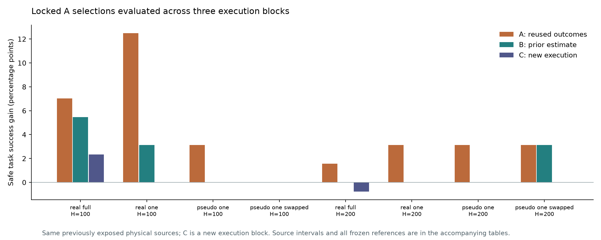

# 从观察到救回，到重复执行的干预收益

本轮把 advisor feedback 推进为实际研究：先在 Quest 统一分析三组旧面板，
随后在看到新结果前锁定 A 选择和 A/B 预测，从完整旧状态运行 C 批次。
论文围绕“观察到的救回、能重复兑现的收益、可部署的选择”三个层次组织。

## 一、既有数据已经回答什么

CPU 作业6240017完成，38秒，提交1b85268。三组数据共1048条原始分支，
分别按物理来源汇总，不合并独立样本数。下表包含全部条件；数值为来源等权的成功增益百分点。

| 面板 / 预算 | 选择与评价每臂重复数 | A同批评价 | B分批评价 |
|---|---:|---:|---:|
| Refresh候选 / 100 | 1 | 12.50 | 3.12 |
| Refresh候选 / 100 | 4 | 7.03 | 5.47 |
| Refresh候选 / 200 | 4 | 1.56 | 0.00 |
| Detour / 220 | 2 | 4.17 | 2.08 |
| Detour / 440 | 2 | 6.25 | 4.17 |
| Refresh复验 / 100 | 4 | 0.00 | 0.00 |

一个重要补充：固定100步的单次A选择不变，Refresh在B的收益从100步的+3.12，
变成200步的−3.12个百分点。完整重复的同一100步选择，在200步B净收益为零，
但仍出现原成功损失和新增事故。预算曲线反映的是接管决策的实际后果。

Base/Base伪干预也可获得表观收益：Detour440的一种预定编号给出A2.08、B0.00；
交换编号后为A6.25、B2.08。这说明不能把某一个伪干预值当统一噪声率。
所有编号、重复数和正常条件都保留在[完整表](evidence/RESULTS.md)。

## 二、前瞻C：Refresh已经完成

作业6240316在27分18秒内完成全部144分支，exit0:0，提交bcaeda7。
全部18个原bundle保留，每臂4个新执行，checkpoint与bundle先校验。
没有新来源、重新生成锚点、重训或调阈值。

| 固定A选择 / 评价预算 | A增益 | B增益 | 新C增益 | A/B逐来源预测RMSE |
|---|---:|---:|---:|---:|
| 单次 / 100 | 12.50 | 3.12 | 0.00 | 25.00 / 19.76 |
| 四次均值 / 100 | 7.03 | 5.47 | 2.34 | 15.93 / 20.73 |
| 单次 / 200 | 3.12 | 0.00 | 0.00 | 8.84 / 0.00 |
| 四次均值 / 200 | 1.56 | 0.00 | −0.78 | 6.63 / 2.21 |

“单次”行在各批次每臂取预定的第一次执行；“四次”行使用每臂全部四次。
因此这两行包含不同的A选择和评价重复数，不能把它们当同一选择器仅增加C样本的比较。
RMSE单位也是百分点，针对逐来源的C观测增益；C仍有有限重复误差。

**支持的部分：** 单次100步参考从A的12.50到新C的0，表观机会没有在该新读出兑现；
其B预测较A更接近C。四次参考有部分100步收益，200步则出现小幅净损害。
Base/Base的单次伪干预在C两预算均为零。

**必须保留的反例：** 四次100步参考的B预测虽然总体均值更接近C，逐来源RMSE却更差。
预定误差改善量D为−0.01758，描述性95%区间[−0.04883,+0.01367]，不能声称独立估计
稳定提升了逐状态或逐来源预测能力。单次100步D为+0.02344，区间[0,+0.07031]。
论文应展示这种差别，不能挑有利指标证明协议全面获胜。

四次100步的C成功增益2.34个百分点，来源bootstrap区间[−4.69,+13.28]；
200步−0.78个百分点，区间[−2.34,0]。这八个来源不足以支撑普遍显著性声明。
100步净正收益同时包含3.91个百分点原成功损失及0.78个百分点新增事故；
200步两者均为0.78个百分点。不能只展示净成功或只展示事故净数。

剩余正收益也有清楚的来源解释：100步四次参考只有一个来源净正、两个来源净负。
正贡献来自b14：Base四次完成步数95/104/101/105，Refresh为95/94/94/94。
到105步两臂全部完成。因此本轮新C也把这一正贡献定位为局部加速和截止附近的标签变化，
不能解释成Base永久无法完成的任务恢复。

结果表、逐来源表与所有原冻结规则见[c_refresh/analysis](c_refresh/analysis/RESULTS.md)。
C.json及分析文件哈希均已核验。完整输入/动作轨迹保留在Quest项目存储。

## 三、前瞻C：Detour完成且保留任务收益

作业6240307在1小时1分29秒内完成全部188分支，exit0:0。固定47个原候选bundle，
每臂2个新执行；原来的一条候选前终局继续保留为共享结果。

| 固定A选择 / 评价预算 | A增益 | B增益 | 新C增益 | A/B逐来源预测RMSE |
|---|---:|---:|---:|---:|
| 单次 / 220 | 4.17 | 2.08 | 2.08 | 8.33 / 0.00 |
| 两次均值 / 220 | 4.17 | 2.08 | 3.12 | 4.17 / 4.17 |
| 单次 / 440 | 6.25 | 4.17 | 4.17 | 8.33 / 0.00 |
| 两次均值 / 440 | 6.25 | 4.17 | 5.21 | 4.17 / 4.17 |

完整重复参考在C的440步成功率69.79%，对应Base64.58%；成功增益5.21个百分点，
描述性95%来源区间[0,11.46]。没有记录到所选参考造成的原成功损失或新增事故。
这些结果属于知道每个状态A后果的特权参考，不是学习gate的方法胜利。

正贡献来自三个fitting来源：e15为+0.5，e18/e21各+1（逐锚点成功概率差）。
e18/e21在A/B/C均保留正收益；C中R分别在202/432步两次成功。e18的C Base一次事故、
一次440步未完成；e21的C Base两次事故。因此不能将所有e18 Base终局写成事故。
e15的C Base一次70步成功、一次41步事故，R两次209步成功；其收益为A0.5→B0→C0.5。
单批复验中的零收益不足以把该状态判成没有干预机会。

四个calibration来源在C仍没有正成功差锚点。完整学习gate仍为全Base，C成功率64.58%；
强Risk→R为60.42%，AlwaysDetour为39.58%。可兑现的局部机会和可部署的选择仍是两个层次。
完整重复参考的A/B逐来源预测误差持平；预定D为0，区间[−0.00521,+0.00521]。
因此两种恢复接口共同反对“独立B估计普遍改善完整重复参考的来源预测”这个强说法。

伪干预方面，Detour第一编号的A/B/C收益为2.08/0/−2.08，交换编号后为6.25/2.08/0，
两预算相同。完整结果见[c_detour/analysis](c_detour/analysis/RESULTS.md)。

## 四、本轮如何回应中心命题

本轮没有把feedback的强命题原封不动地写成成功结论。结果支持一个更准确的故事：
**观察到的救回、可重复的干预收益和可部署选择需要分别评价；一批新的执行能检验既有判断，
但一批估计本身也可能过高或过低。**

Refresh单次12.50→3.12→0的序列支持表观收益消退；其C残余正效应由截止附近加速解释。
Detour完整重复6.25→4.17→5.21的序列则保留真实任务收益，并提供e15的收益再次出现这一反例。
这些结果让论文从单向“高估批判”变成对不同恢复证据的可检验区分。

两项GPU作业共332条新分支、约1.48个A100 GPU小时，零新增来源与前缀。两组C与所有分析文件
完成哈希核验，原始轨迹保留于Quest项目存储；本地保存终局、选择与报告所需的小型证据。

## 五、论文故事已经如何推进

已有一份连贯的[英文正文](../../../iclr27/repeatable_value/manuscript.md)及审阅PDF。
核心故事是：一次救回不自动等于重复收益；重复收益还需要和任务预算、正常任务损害
及执行前选择分开评价。现在新增了C的前瞻证据，而不只是在已经暴露的A/B上解释历史。

当前结果支持有范围的实证故事，没有支持“所有恢复收益都被高估”或“分开估计总能更准”。
更强的外部恢复技能、独立新来源和最终可部署选择仍是主会论证的实质缺口；
本轮先把已经得到的事实写成可读、可审的论文，不自动加网络或扩benchmark。
