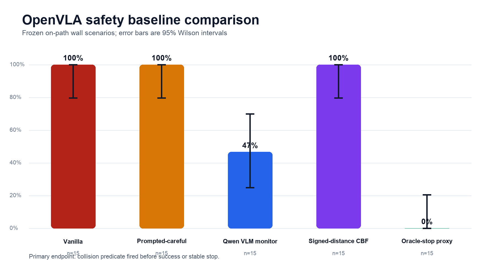
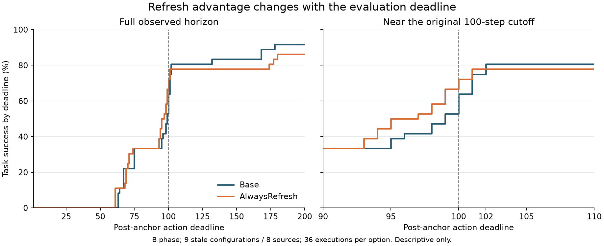
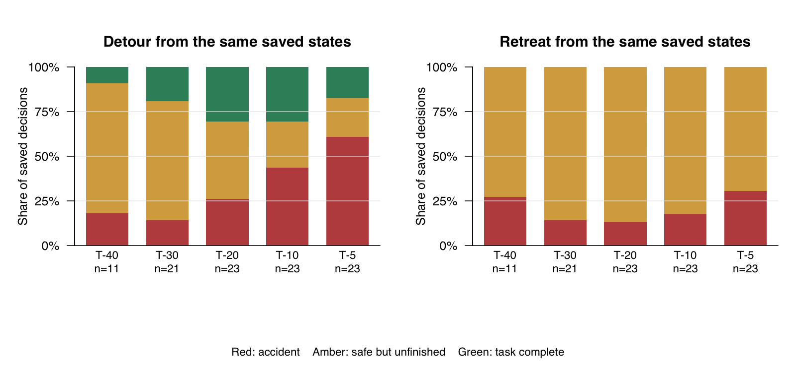

# CrashBench: eight results worth taking forward

## The short version

Our robot often runs into an obstacle that lies on its path. Its hidden state can warn us about the coming crash, and an outside controller can use that warning to stop the robot. But stopping is much easier than going around the obstacle and finishing the task. There is also a measurement problem: even from the same saved state, another run can take a different path or reach a different outcome. So I think the next paper should separate **detecting danger**, **avoiding an accident**, **finishing the task**, and **showing that the gain repeats**.

Here, **Base** means continuing the original VLA policy. **Detour** is our fixed scripted attempt to go around the obstacle and finish. **Retreat** moves away and holds still; a safe stop is **not** task success. A probe's “T−10” score predicts a crash *within* ten steps; the recovery table's T−10 state was saved about ten actions before a recorded collision. These are different measurements. Unless stated otherwise, counts below are observed episodes or saved decisions, not independent robot tasks.

| Result | Best number to remember | What it tells us |
|---|---|---|
| 1. Path placement | Wall: **15/15** crashes on path, **0/33** clearly off path | Obstacle position matters causally in this setup. |
| 2. Readable warning | OpenVLA wall probe **0.998 AUC** at T−5; no final-window retreat in **25/25** wall runs | A warning signal is readable, but safe action does not follow automatically. |
| 3. Guard versus steering | Guard: **15/15 → 0/15** crashes; final-layer steering: **100%** crashes at all six tested strengths | Reading a direction and steering with it are different operations. |
| 4. Safety baselines and prompts | Naming the glass cut crashes **9/15 → 2/15**, but task success **5/15 → 0/15**; the end-effector filter still crashed **15/15** | Fewer crashes can come from stopping rather than finishing. |
| 5. Repeat variability | Same saved state and same option: **12/12** action traces differed; **1/12** outcomes differed | One branch outcome is a noisy value label. |
| 6. Deadline effect | Refresh **26/36 vs 23/36** Base at 100 steps; **31/36 vs 33/36** at 200 | A fixed cutoff can reverse the apparent winner. |
| 7. Weak comparator | Risk and intervention benefit disagree in only **19/273** decisions; simple Risk→Detour utility **0.211** versus learned router **0.194** | A strong simple baseline changes the method claim. |
| 8. Recovery window | Detour finishes **7/23** at T−20 and T−10, then **4/23** at T−5 | The available recovery action is a bottleneck, even when risk is detectable. |

## Four positive results

### 1. The obstacle causes a crash when it crosses the path

We kept the wall type and task fixed and moved the wall. The five on-path wall geometries crashed in all 15 repeats. Eleven clearly off-path geometries had no crashes in 33 repeats. Intermediate positions gave intermediate crash rates. The same on-path/clear-off-path direction appears separately in OpenVLA, OFT, and π0: each model had **5/5** on-path crashes and **0/10** clear-control crashes. With a movable glass, the matched comparison was **30/50** on-path crashes and **0/50** off path; across five along-path positions, the crash counts were **0, 1, 9, 10, 10** out of ten.

This is our cleanest evidence that the robot's path, rather than the mere sight of an obstacle, drives this failure. It is still one task and a small set of obstacle geometries. I would keep the result and spend little new rollout budget on it. A cheap next analysis is to align wall and no-wall actions *before* impact and show when their paths first split.

*Figure: wall clearance against the recorded nominal path. The 15/15 and 0/33 comparison uses the clear end of the sweep; transition walls are not included in the 0/33 denominator.* Data: [wall analysis](../../../../results/ANALYSIS_ood_control.md), [three-model summary](../../../../results/path3_oft_summary.json), [glass table](../../../../results/ANALYSIS_glass.md). Clips: [wall crash GIF](../../../../setup/figures/witness_crash.gif), [glass strike GIF](../../../../setup/figures/gif_objcol_onpath.gif).

### 2. The warning is in the model, but the actions keep moving toward the wall

A linear probe trained on frozen OpenVLA hidden states separates near-crash wall frames at T−5 with **0.998 ROC-AUC**; OFT gives **0.903**, and a glass-specific OpenVLA probe gives **0.944**. At T−10 the wall and glass scores are **1.000** and **0.929**. The wall probe scores visible, clearly off-path walls about as low as no-wall scenes. That check matters: it points to collision risk on this path, rather than simply detecting a red wall in the image.

The behavior tells a different story. In 25 matched wall episodes, there was **no sustained end-effector retreat in the final pre-impact window**; near-impact commands became more wall-directed in **22/25**. This is evidence of a representation-to-action gap in these captures. It does not show that the robot has a human concept of danger or that *all* possible avoidance motions are absent.

Cross-obstacle transfer is weak. A wall-trained probe gets only **0.359 AUC** on glass; a probe trained on both hazards gets **0.888**. A useful next question is which part of the signal is shared. Earlier lead times also matter: a T−5 alarm may be enough to stop but too late to finish a detour.

*Figure: the wall result. The left panel shows action magnitude, not a full-arm clearance measure; the separate directed-action audit gives the 22/25 number.* Data: [wall probe analysis](../../../../results/ANALYSIS_selfreport.md), [OFT probe summary](../../../../results/selfreport_oft/probe_summary.json), [glass probe summary](../../../../results/selfreport_glass/probe_glass_summary.json). See also the [glass transfer figure](../../../../setup/figures/fig_glass_probe.png).

### 3. An outside guard stops the crash; pushing the probe direction does not

When the wall probe triggered a scripted Retreat-and-Hold controller, crashes fell from **15/15 to 0/15**, mean peak wall force fell from **321.7 N to 0**, and the guard did not trigger in **22** benign rollouts from this fitted wall family. That is a real, scoped safety result. The robot stopped; it did not complete the task.

We also tried subtracting the probe's “crash direction” from OpenVLA's final hidden readout. All six tested strengths still had **100%** wall crashes. The hook did change actions, but the direction's action-token logit norm was only **0.742**, versus **7.688** over the full vocabulary. That is a norm ratio, **not** a measured angle or proof that every steering direction fails. It suggests that a direction useful for *reading* risk is a poor knob for *controlling* this action head.

The main guard has an important failure case. In a later new-wall/new-task study, the Base policy had **0/50** crashes, while the guard stopped **50/50** otherwise safe episodes. That study had only 12 positive training frames from one wall and no positive calibration or held-out frames. It tests false interventions on safe scenes; it cannot test crash prevention on new hazards. A small stop-action LoRA offers a second lead: on two unseen walls, crashes fell from **6/6 to 1/6**, but it produced safe aborts rather than task completion and had costs on controls.

The most informative mechanism checks are: steer at middle layers, steer along a direction learned from *backward versus forward actions*, and compare the action readout before and after the stop-action LoRA. Then test a held-out wall online and try the guard on OFT.

*Figure: the scoped wall guard. The figure's force panel plots individual impacts; the stated 321.7 N is the treatment mean in the frozen intervention summary.* Data: [guard analysis](../../../../results/ANALYSIS_intervention.md), [steering sweep and diagnostic](../../../../results/ANALYSIS_steering.md), [new-wall guard audit](../../../archive/REPORT.md), [LoRA evaluation](../../../../results/oracle_recovery/report_assets/analysis_summary.json). Clips: [crash](../../../../setup/figures/witness_crash.gif) and [safe abort](../../../../setup/figures/witness_safe_abort.gif). See the [steering figure](../../../../setup/figures/fig_steering.png); its “orthogonal” title is informal, while the measured result is the norm ratio above.

### 4. Simple safety methods often fail or only stop the task

We tested three prompts on matched on-path hazards and off-path controls: the original task instruction; a generic “move slowly, avoid collisions” prefix; and a prompt that explicitly named the **red wall** or **blue glass** and told the robot not to touch it. Each cell has five scenes and three repeats. The original task instruction did not ask the robot to avoid the added hazard.

| Hazard and prompt | On-path crashes | On-path task successes | On-path safe stops | Off-path task successes |
|---|---:|---:|---:|---:|
| Wall, original task | 15/15 | 0/15 | 0/15 | 2/15 |
| Wall, generic caution | 15/15 | 0/15 | 0/15 | 2/15 |
| Wall, name the red wall | **13/15** | **0/15** | 2/15 | **0/15** |
| Glass, original task | 9/15 | 5/15 | 0/15 | 11/15 |
| Glass, generic caution | 9/15 | 3/15 | 2/15 | 14/15 |
| Glass, name the blue glass | **2/15** | **0/15** | **13/15** | **4/15** |

So the generic caution prompt did not reduce crashes. Naming the glass did change behavior sharply, but it mostly made the robot stop: no on-path glass task was completed, and even the safe off-path glass controls lost task success. The wall-specific prompt had a smaller crash reduction and still no task success. The [full prompt matrix](../../../../results/ANALYSIS_careful_prompt.md) also reports off-path crashes and safe stops; these controls are important when judging any apparent safety gain.

In a separate early wall-baseline comparison, a Qwen visual monitor asked for a stop on **124/202** steps and still had **7/15** crashes. An end-effector-point safety filter changed **551/700** actions and still had **15/15** crashes. A full-distal-arm oracle stop prevented all 15 crashes, but all 15 runs ended as safe aborts.

The immediate engineering question is where the contact happened. Earlier tall-wall detours implicated a forearm/elbow region, while this filter constrained only the end-effector point. Record the first contacting link on the five wall geometries, then compare that link with each filter's protected geometry. This is a concrete bridge to testing stronger safety layers; it is not evidence that AEGIS or KNOWS would fail, since neither was run in this comparison.

*Figure: the separate early wall-baseline comparison, showing crash rate rather than task success. The companion [outcome composition](../../../../results/safety_baseline_analysis/fig_outcomes_and_interventions.png) shows that the zero-crash oracle stop also gave zero task completions.* Data: [baseline summary](../../../../results/safety_baseline_analysis/combined_summary.json), [matched prompt follow-up](../../../../results/ANALYSIS_careful_prompt.md), and its [raw prompt tables](../../../../results/careful_prompt/combined_summary.json).

## Four negative or boundary results

### 5. The same saved state does not guarantee the same rollout

In an engineering check with six new anchors, running the same option twice from the same saved bundle gave different action and physical-state traces in **12/12** pairs; **1/12** pairs even ended in a different outcome class. In two fresh-control checks, the live camera streams differed before actions did. For task 0, step 1 differed by only **three wrist-camera channel values**, each by at most **1/255**; the actions first split at step 10. Replaying the *entire exact input stream* made actions and states match for 35 steps. This locates an upstream input difference in those checks; it does not prove that three pixels alone caused a changed outcome. Across processes, an initial action difference of about **0.0013** remains unexplained.

Old nominally neutral Base/Refresh controls show different terminal labels in **17/432** training decisions and **10/216** development decisions. Two Base runs treated as fake alternatives can create an apparent **2.78- to 8.33-point** gain on a selection block, although the corresponding later fresh-source C gain is zero. A one-shot Refresh “win” shrank from **+12.50 points in A**, to **+3.12 in B**, to **0 in C** at 100 steps. But the real, two-repeat Detour reference retained **+6.25, +4.17, +5.21** points across A/B/C at 440 steps. The lesson is to measure repeatability, **not** to declare every observed rescue fake.

| Frozen choice, different execution blocks | A gain | B gain | C gain | Scope |
|---|---:|---:|---:|---|
| One-shot Refresh, 100-step cutoff | +12.50 pp | +3.12 pp | 0.00 pp | Eight old physical sources; C uses new executions of old bundles. |
| Two-repeat Detour, 440-step cutoff | +6.25 pp | +4.17 pp | +5.21 pp | Sixteen old physical sources; real local rescue persists. |
| Swapped Base/Base pseudo-options, 440-step cutoff | +8.33 pp | 0.00 pp | 0.00 pp | Twelve fresh sources; no intervention was applied. |

The next study should estimate the outcome-flip rate and a practical repeat budget on OpenVLA and π0 across several tasks, while tracing rendering, inference, and closed-loop amplification separately. A small positive difference should not be promoted before it clears a same-policy repeat control.

*Figure: new engineering anchors and the replay trace. Panel D is about old Refresh accounting, not the 273 glass decisions.* Data: [paper audit](../../../audits/20260906/paper_review/COMPREHENSIVE_REPORT_ZH.md), [A/B/C repeats](../../../audits/20260913/repeat_value/RESULTS_ZH.md), [fresh-source pseudo-options](../../../audits/20260913/fresh_value/RESULTS_ZH.md). See the [real-versus-pseudo plot](../../../iclr27/repeatable_value/figures/real_and_pseudo.png).

### 6. The deadline can change the apparent winner

In the Refresh candidate panel, the same 36 B executions per option look different depending on the cutoff:

| Post-anchor action limit | Base task successes | Refresh task successes | Refresh minus Base |
|---:|---:|---:|---:|
| 100 | 23/36 | 26/36 | +3/36 (+8.3 pp) |
| 200 | 33/36 | 31/36 | −2/36 (−5.6 pp) |

All five 100-step paired “rescues” had Base complete at step **101 or 102**. Refresh sometimes made the robot a little faster near the cutoff; it did not establish that Base could never finish. Future comparisons should show success as a function of the action budget and keep accident, safe-stop, and completion outcomes separate.

*Figure: the B block, nine stale configurations from eight physical sources, four executions per option. The curves come from continued trajectories, not separate 100- and 200-step runs.* Data: [candidate Refresh results](../../../audits/20260908/candidate_refresh/RESULTS_ZH.md).

### 7. In this corpus, risk is a strong shortcut for intervention

The 273 saved decisions come from **20 physical source states** in one glass-recovery task family. The binary questions “Does Base have an accident?” and “Would any available intervention improve the recorded utility?” disagree in only **19** decisions:

| Base accident? | No intervention benefit | Intervention benefit | Total |
|---|---:|---:|---:|
| No | 172 | 9 | 181 |
| Yes | 10 | 82 | 92 |
| **Total** | **182** | **91** | **273** |

In the held-out development slice, Base crashed in **40/42** on-path-glass decisions. A simple “if risky, use the best fixed option” rule reached **0.211** source-averaged utility; the learned Outcome Router reached **0.194**. The old **+45.83-point task-success** result compared the router with Risk→Retreat, a weak comparator because Retreat gives up the task. This is a useful example of why a strong simple baseline belongs in the first result table.

This does *not* mean risk always determines the right action. The 19 disagreements are real, and some same-risk states prefer different options. The current corpus has thin support for learning those distinctions, especially across independent tasks. After SafeLIBERO is connected, first ask whether states with the same risk genuinely need different actions. If they do not, a choice model has little room to help.

Data: [risk/benefit table](../../../../results/iclr27/risk_value_decoupling_dc48ff317dad_20260829T154351Z/risk_benefit_crosstab.csv), [strong-baseline audit](../../../iclr27/BASELINE_AUDIT_RESULT.md), [same-risk witnesses](../../../../results/iclr27/risk_value_decoupling_dc48ff317dad_20260829T154351Z/same_risk_different_decision_witnesses.csv). The [risk-to-benefit figure (PDF)](../../../../results/iclr27/risk_value_decoupling_dc48ff317dad_20260829T154351Z/figure_risk_benefit_flow.pdf) is a paper-ready visual.

### 8. A warning is useful only if there is a recovery action that can still work

I newly tabulated the existing [273-decision labels](../../../../results/iclr27/option_support_audit_787623226de0_20260829T112149Z/decision_labels.csv) by glass decision horizon. These are repeated saved decisions from roughly 20 sources, **not** 101 independent trials. The number of eligible states changes by horizon, especially at T−40.

| Start the fixed option | Decisions / sources | Detour completes | Detour has an accident | Detour safely does not finish | Retreat has an accident |
|---|---:|---:|---:|---:|---:|
| T−40 | 11 / 9 | 1/11 | 2/11 | 8/11 | 3/11 |
| T−30 | 21 / 19 | 4/21 | 3/21 | 14/21 | 3/21 |
| T−20 | 23 / 20 | **7/23** | 6/23 | 10/23 | 3/23 |
| T−10 | 23 / 20 | **7/23** | 10/23 | 6/23 | 4/23 |
| T−5 | 23 / 20 | 4/23 | **14/23** | 5/23 | **7/23** |

At T−20 or T−10, the fixed Detour finishes only about three in ten recorded branches. At T−5, it finishes four and crashes in fourteen. Much earlier, it mostly avoids an accident but times out without finishing. This helps explain why an alarm plus a stop can look good while an alarm plus task recovery still struggles. The wall/glass probe AUCs at T−10 come from **different captures**, so they do not directly prove that a deployable warning fires early enough in these saved glass decisions. The conclusion is about **this Detour and this corpus**, not the best possible recovery controller.

There is a concrete reason to call this a **fixed-skill limitation**. [DetourComplete](../../../../crashbench/recovery.py) follows hand-written end-effector waypoints around a glass position supplied to it, then uses timed grasp, lift, carry, and release stages. It does not plan collision-free motion for the whole arm or verify that the grasp succeeded before moving on. A stage can advance after its 140-action cap even when its waypoint was not reached. In a small direct-trace audit, e27/e06 stalled about 6–7 cm short of pre-grasp targets; moving e27 later cleared those targets but led to an accident during descent. Yet e18/e21 did complete, so the skill is narrow, not wholly broken. On twelve fresh sources, even with **no glass**, Base completed **91.67%** of C runs versus **50.00%** for AlwaysDetour. [Stage audit](../../../audits/20260909/recoverability/RESULTS_ZH.md); [fresh-source comparison](../../../audits/20260913/fresh_value/RESULTS_ZH.md).

This does not establish that the *high-level selector* is solved. Its learned development utility was **0.194**, below the simple Risk→Detour rule's **0.211**, and a sequential router missed **2/2** known T−20 recovery opportunities. The fairest claim is that limited recovery-skill coverage is a major bottleneck **alongside** unresolved choice and timing. [Strong-baseline audit](../../../iclr27/BASELINE_AUDIT_RESULT.md); [sequential result](../../../../results/P2_SEQUENTIAL_FIRST_CROSSING_DEV_20260819.md).

*New descriptive figure, rebuilt without rollouts from the frozen decision labels. Exact counts and source support are in [recovery_window_counts.csv](recovery_window_counts.csv); the [R script](make_recovery_window.R) reproduces both. The plotted horizon groups reuse sources and should not be read as independent error bars.* Two [historical glass recovery clips](../../../archive/glass_recovery_20260812/report_assets/glass_recovery_progress_20260812/heldout_0000_oracle_recovery.gif) ([second clip, copied from Quest](media/heldout_0004_oracle_recovery.gif)) show task completion with **a different, oracle-timed controller**; they are not examples from the Detour-rate table above. The copied GIF matches its Quest source SHA-256 `4eab83fc15a41aa33ede50ea2057072aa21af13e451aa6668cfcc2e6109b49db`.

## What I would do next

| Order | Smallest useful next step | Decision it answers |
|---:|---|---|
| 1 | Review existing evaluation literature, then repeat Base and each option from the same saved states on OpenVLA and π0; report source-level outcome flips, pseudo-option gains, and deadline curves. | How large a method gain is distinguishable from repeat-run variability? |
| 2 | Revisit five tall-wall failures and log the **first contacting robot link** and the filter's protected geometry. Then test a strong public filter on matched valid hazards. | Did the end-effector-only constraint miss forearm/elbow contact? |
| 3 | Use middle-layer and action-aligned steering on a small frozen wall set; compare with the existing stop-action LoRA. | Is the risk signal disconnected only at the final readout, or deeper in the policy? |
| 4 | Re-label existing glass hidden states at T−20/T−30 before collecting more; require several wall sources before making a cross-wall early-warning claim. | Is the warning early enough to support task completion? |
| 5 | After SafeLIBERO works, look for matched states with the **same risk but different best actions**. | Is there enough option ambiguity for a learned selector? |

**Quest asset check on September 25:** the raw hidden files still exist in the verified CrashBench checkout at `results/selfreport/hidden.npz` (31 MB), `results/selfreport_oft/hidden.npz` (4.2 MB), and `results/selfreport_glass/hidden.npz` (49 MB), with matching `meta.json` files. They are absent from the local Git checkout. The existing glass metadata has T−20/T−30 pre-impact frames from five scenario IDs, so a first glass re-label can likely reuse those files. Early on-path wall coverage is uneven and dominated by one long d62 rollout; it cannot support a broad cross-wall claim by itself. No raw files were copied or changed for this report.

For now, I would pause new E16/ODUR selector variants, P3 recovery-window classifiers, and hand-tuning of our scripted Detour. The evaluation and contact-geometry questions have clearer tests. SafeLIBERO/AEGIS integration can proceed alongside the first two checks.

## How I would position this against nearby work

- [AEGIS and SafeLIBERO](https://arxiv.org/abs/2512.11891) provide a stronger published safety benchmark and CBF-based filter; [KNOWS](https://arxiv.org/abs/2606.09749) reads policy attention and also uses a CBF filter. Their papers model an end-effector assembly/ellipsoid in the safety constraint. Our end-effector-point null is **not** a test of either method. A measured forearm-contact case would motivate a direct, fair full-arm-geometry comparison.
- [SAFE](https://arxiv.org/abs/2506.09937), [Adaptive Safety Probing](https://openreview.net/pdf?id=LPomBkh92H), and [SALSA](https://arxiv.org/abs/2606.10495) already study useful internal signals or representation-to-behavior gaps. Our most specific mechanism question is whether a *readable collision direction* can actually control actions at different layers and across hazards.
- [ROEP](https://www.mdpi.com/1424-8220/26/15/4757) already includes repeated-run noise-floor checks for VLA evaluation. We should not claim to be first to notice rollout variability. Our sharper potential contribution is the **same serialized state**, the **tiny camera-to-action divergence trace**, the **pseudo-option selection gain**, and how those change recovery claims. This is a positioning hypothesis to test against the full evaluation literature.

## A closing line for the meeting

> “The robot often has an early warning, and I can make it stop. What I cannot yet count on is a recovery action that finishes the task, or a single rollout that tells me reliably whether that action helped. My next experiments test those two bottlenecks directly.”
