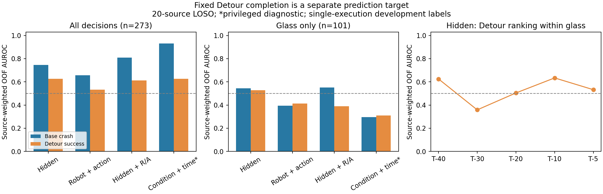

# 第一步结果：隐藏状态能否预测固定 Detour 的任务完成

**已在 Quest 跑完。结论是：混合场景中有一些预测信号，但在真正需要讨论恢复的玻璃场景内，尚未建立可靠的可恢复性检测能力。现在不适合把这个探针接成“判定没救就停止”的开关，也不足以给 benchmark 标注可靠的可恢复/不可恢复标签。**

这不等于研究方向失败。它把下一步的问题具体化了：需要区分固定技能的成功支持、跨来源预测、同一来源中的时机排序，以及概率是否可信；不能再用一个混合场景 AUC 代替这些问题。

## 1. 做了什么，标签到底是什么

- 使用原 job9288681 的全部 **273 个决策、20 个物理来源**；其中玻璃101、偏离路径86、无玻璃86。没有新增轨迹或改写历史结果。
- 输入为每个 T−40/30/20/10/5 决策的当前4096维隐藏状态。每折只用训练来源拟合 PCA16 和标准化，再拟合固定 L2=0.01 的线性 logistic 探针。没有选择最佳层数、维度、阈值或时间点。
- 主评估为留一物理来源交叉验证：同一来源的全部时点、摆放和条件一起留出。主指标给每个来源相同总权重，再计算 pooled AUROC；**不是逐来源 AUC 的平均**。逐决策加权和逐来源结果另存。
- 用相同输入、划分和训练方式，分别预测 Base 事故、Detour 成功和 Base 成功。固定比较包括机器人状态+名义动作、两者与隐藏状态结合、条件+时间的特权诊断，以及训练集成功率。
- 两个预定敏感性检查是：仅玻璃数据的20折评估；历史5来源训练→8来源开发评估。历史7个 calibration 来源不参与后者，因为本次不调参。

这里的正标签是 **“这个固定 Detour 在该次执行、原预算下安全完成了任务”**。原 collector 的后续动作上限分别为 Base220、Detour900、Retreat80，且允许提前终止。因此标签不等于同预算下的净收益，不等于其他恢复办法有无解，也不等于物理可能性。一次二元终局也不是该状态重复成功概率的可靠估计。

## 2. 主结果：混合场景的信号没有变成玻璃内的可靠判别

下表为隐藏状态主探针；区间是2000次按来源整块重采样的95%区间，条件于已经拟合的折外预测，没有重新拟合，也没有消除历史探索产生的不确定性。

| 训练与评估 | 预测目标 | 评估决策 | 来源等权 AUC | 95%区间 |
|---|---|---:|---:|---|
| 全条件 LOSO，全部评估 | Base 会不会发生事故 | 273 | **0.745** | [0.653, 0.825] |
| 全条件 LOSO，全部评估 | Detour 能否成功 | 273 | **0.626** | [0.514, 0.732] |
| 全条件 LOSO，只看玻璃 | Detour 能否成功 | 101 | **0.528** | [0.351, 0.700] |
| 全条件 LOSO，只看玻璃且 Base 失败 | Detour 能否成功 | 99 | **0.524** | [0.351, 0.690] |
| 仅玻璃训练与评估 LOSO | Detour 能否成功 | 101 | **0.576** | [0.414, 0.731] |
| 历史5来源训练→8来源开发，只看玻璃 | Detour 能否成功 | 42 | **0.441** | 本方案未对该敏感性计算区间 |

全条件下，Detour 与事故预测的 AUC 差为−0.119，配对来源区间[−0.239, −0.008]。这是不同标签的描述性比较，说明本次固定预测任务的难度不同，不能推导出可恢复性在所有设置中一定更难。

真正影响研究判断的是中间三行：去掉场景之间的区别后，玻璃内的任务完成排序接近随机，区间宽；专门在玻璃数据上训练也没有建立明确的排序优势。历史固定划分的结果同样不强。逐决策加权主探针 AUC 为全部0.570、玻璃0.513，说明加权方式也影响混合总体的数值。

### 为什么不能与旧的0.998直接相减

旧0.998是墙壁实验的 T−5 危险探针。这里换成了玻璃决策数据、跨物理来源评估、原始候选决策后的 Base 分支终局，以及当前帧 PCA16 的固定探针。因此本次相同设置下重新训练的事故探针是0.745，不能用旧0.998作为这273个决策的已知性能，也不能把差异写成旧结果被推翻。

玻璃子集里91/101的 Base 分支出事故，只有10个非事故决策，来自8个来源。这里的事故 AUROC 不再是在危险场景与安全对照之间排序。全条件训练的事故探针在玻璃内 AUC 为0.545；仅玻璃训练时为0.304，固定0.5阈值的 balanced accuracy 为0.5。这些数字不能被包装成“第一层始终解决、第二层单独失败”的干净对照。

## 3. 隐藏状态是否比简单信息多提供了东西

所有模型均按相同来源划分；前四行是同一个 Detour 成功目标。

| 输入/分数 | 全条件训练，全部评估 AUC | 全条件训练，玻璃评估 AUC | 仅玻璃训练/评估 AUC |
|---|---:|---:|---:|
| 隐藏状态 | 0.626 | 0.528 | 0.576 |
| 机器人状态+名义动作 | 0.533 | 0.412 | 0.516 |
| 隐藏状态+机器人状态+名义动作 | 0.613 | 0.390 | 0.534 |
| 条件+时间，特权诊断 | 0.627 | 0.309 | 0.385 |
| 1−隐藏状态事故分数，固定风险排序基线 | 0.667 | 0.600 | 0.526 |

有一项应保留的正面发现：混合总体中，隐藏状态比机器人状态+动作的 AUC 高0.092，来源区间[0.035, 0.148]。但玻璃专用模型对应差仅0.060，区间[−0.093, 0.201]。此外，直接预测 Detour 的排序没有明确超过简单的逆风险分数：全条件模型在玻璃内的差为−0.072，区间[−0.238, 0.066]。**不能据此声称已经读出了独立于危险程度的可恢复性能力。**

概率误差也没有给出强证据：玻璃专用隐藏探针 Brier 为0.194，训练来源成功率基线为0.197，差值−0.003，区间[−0.035, 0.032]。逆风险分数预测的是另一事件的补集，未经 Detour 概率校准，其 Brier 不宜被当作等价概率模型的性能下界。

一个评估细节必须保留：LOSO 中每折的训练成功率会随留出来源改变。留出成功率高的来源会降低训练成功率，导致汇总折外的“常数先验”AUC可能远低于0.5；例如玻璃专用先验为0.036。它在每个来源内的 AUC仍为0.5。不能拿它作随机排序基准，进而夸大隐藏探针的 AUC 增益。本报告用随机参考0.5、同目标简单模型、Brier、逐来源结果和历史单次划分共同判断，保留原始输出而不翻转分数。

## 4. 时间与来源支持：现在还没有清晰的恢复窗口

| 玻璃决策时点 | 决策数 | Detour成功数 | 成功来源数 | 主隐藏探针 AUC |
|---|---:|---:|---:|---:|
| T−40 | 11 | 1 | 1 | 0.625 |
| T−30 | 21 | 4 | 4 | 0.358 |
| T−20 | 23 | 7 | 7 | 0.504 |
| T−10 | 23 | 7 | 6 | 0.634 |
| T−5 | 23 | 4 | 4 | 0.532 |

不能选择T−10作为新主结果，也不能把T−40的0.625理解为稳定的提前检测能力：T−40只有一个成功来源。各时间点可用来源不完全相同，表中的成功率起伏不是同一组来源的完整窗口曲线。

全部23个玻璃成功决策仅来自 **7个物理来源**；只有6个来源同时包含成功和失败决策，能计算来源内 AUC。全条件训练主探针在这6个来源上的平均 AUC为0.368；玻璃专用探针为0.694。后者是可保留的局部排序线索，但只涉及6个来源，且这些来源内可能同时包含不同摆放，不能直接称为可靠的时间窗口检测。

跨来源分数也明显失准。例如来源`6292759e…`四个玻璃决策全部成功，玻璃专用探针的平均分数却只有0.212；来源`a992f0a5…`四个决策全部失败，平均分数为0.491。这说明局部排序与可跨来源使用的统一阈值是不同要求。[全部逐来源结果](evidence/per_source.csv)。

## 5. “知道没救了就停”现在能否成立

先只把低 Detour 分数当作一个待审计的标记，不实际执行停止动作。预定阈值结果如下：

| 探针 | 低分阈值 | 被标记的玻璃决策 | 涉及来源 | 其中实际 Detour 成功 |
|---|---:|---:|---:|---:|
| 全条件主探针 | <0.10 | 7 | 2 | 0 |
| 全条件主探针 | <0.20 | 11 | 3 | 0 |
| 全条件主探针 | <0.50 | 71 | 20 | **17** |
| 玻璃专用探针 | <0.10 | 29 | 12 | **3** |
| 玻璃专用探针 | <0.20 | 53 | 18 | **10** |
| 玻璃专用探针 | <0.50 | 97 | 20 | **21** |

主探针最保守的低分区域没有观察到漏掉 Detour 成功，但只覆盖2–3个来源，不能据此认证“没救”。玻璃专用探针即使在10%阈值下也已经标记了3个实际成功状态。其[校准表](evidence/calibration.csv)中0–0.2区间平均预测约0.097，来源加权实际成功率约0.206。

更根本的问题是：**Detour 不成功也不等于应该放弃 Base。** 全条件主探针在0.5阈值下标记169个决策，其中88个 Base 实际成功，109个至少有 Base 或 Detour 成功。即使在0.2阈值下，全部12个标记中仍有1个 Base 成功。当前数据也没有评估一个新停止策略执行后的安全性；以上数字是放弃可完成任务的反事实审计，不是停止策略的线上效果。

因此，导师建议中的第二层问题值得研究，但“一个低可恢复性分数即可决定安全停止”的应用仍需要单独证明。

## 6. 这对下一步意味着什么

**建议先做技能相对、预算明确的可恢复性研究，而不是立即扩 benchmark 或增加预测头。** 这次实际做的是第一项必要检查：现成隐藏状态加一个固定简单探针能否直接解决问题。答案是尚不能，尤其在需要恢复的玻璃内部。

下一步按以下顺序更有信息价值：

1. **先与导师锁定研究对象。** 将目标写成固定技能R在给定后续预算H下的安全完成概率 `q_R(s;H)`，同时保留 Base 的 `q_B(s;H)`。本轮只有各自预算下的一次终局；“技能成功”“相对 Base 有收益”“任意方法存在解”要分开。若研究不可恢复性的识别，可使用“支持成功、支持失败、证据不足”的表达，不能把缺少一次成功直接补成负面真值。
2. **优先核对已有完整状态与重复证据能支持哪些标签。** 本273档案封存了特征、元数据和终局，没有在清单中提供每个决策可直接恢复的完整 bundle；不能承诺把原273状态原样再跑。先核对现有完整 bundle 和重复面板，明确可重复执行的是哪些状态、预算是否统一、输入与终局如何对应。若以后另行收集重复执行，应保存新的完整 bundle、按来源覆盖成功/失败/模糊区域，并清楚标注它们是新锚点，而不是冒充原锚点复现。
3. **用已有机制证据确定下一项信息检验。** e18/e21微型实验显示抓取前目标跟踪、下降安全性和搬运阶段有关；这些是执行后解释，不能直接塞进执行前探针。应先确定哪些执行前可观测量能刻画固定技能的适用范围，再比较它们与当前隐藏表示。只有来源间概率和标签可靠性有依据后，才值得重新讨论低误放弃的选择或停止策略。

这里不能预先把低AUC全归因于“标签不稳定”。[已有微型实验](../../20260909/recoverability/RESULTS_ZH.md)中12个Detour子状态的两次终局一致，而 Base 的重复更不稳定；e21还展示了预算造成的标签变化。这支持“分别审计每个技能及预算”，不支持“所有恢复标签都是噪声”的统一解释。

也不能忽略[新来源实验](../../20260913/fresh_value/RESULTS_ZH.md)：固定 Detour 在未经成功/危险筛选的新来源上缺少可重复的净收益支持。这与本轮玻璃来源间预测弱相容，但不同来源构造、控制流程和预算阻止我们把它们合并成一个确认结论。

**适合向导师汇报的一句话：** 我把“Detour能否完成”单独作为检测目标，在20个物理来源上隔离评估；混合场景 AUC0.626，但玻璃内部只有0.528，玻璃专用训练0.576且区间覆盖随机，低分还会漏掉真实成功。下一步应明确固定技能与预算下的可恢复性标签、来源支持和执行前信息，而不是把旧事故AUC直接迁移成可恢复性能力。

当前没有新增训练、轨迹、确认集或 benchmark 扩展任务。上述下一步是研究建议，不是自动追加的实验。

## 7. 执行与复核

- Quest job **7454767**，`COMPLETED`，主作业/batch退出`0:0`，用时`00:00:29`，峰值内存172868KB。
- 执行提交 `7801087aa253cb173f507903ea5e86a5228ceefc`；已发布分支 `codex/recoverability-probe`，包含 GitHub 最新稿件提交`c4497cf`。用户本机未提交稿件与演示文件保留。
- Slurm `p33100 / short`，4 CPU，8GB上限，节点`qnode0108`；Python3.10.20、NumPy1.26.4。7项合成测试在本机与Quest均通过；41组划分、615个固定目标/输入拟合全部收敛，没有单类训练折。
- 原始结果：Quest `$HOME/crash_bench/results/recoverability_hidden_probe/7801087aa253_7454767/`；大体积`models.npz`保留在Quest及本机忽略目录。没有新增环境动作、VLA推理或D8访问。
- [冻结计划](PLAN.md)、[运行记录](RUN.md)、[运行来源](evidence/provenance.json)、[配置](evidence/config.json)、[全部指标](evidence/metrics.csv)、[折外预测](evidence/predictions.csv)、[折划分与收敛](evidence/folds.json)、[来源重采样区间](evidence/bootstrap.json)、[低分审计](evidence/low_score_audit.csv)。
- 取回后已核对[原始完成清单](evidence/complete.json)中全部输出哈希。该清单还列出未复制到文档目录的`models.npz`；[证据复制清单](evidence/COPY_MANIFEST.json)明确哪些文件随本报告保存。
