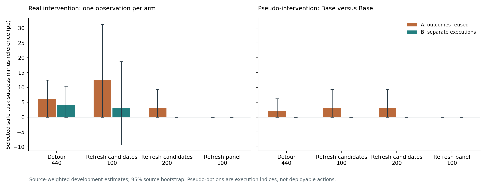
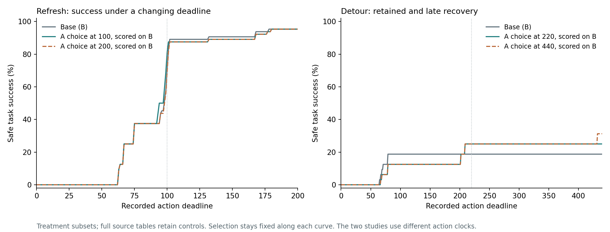
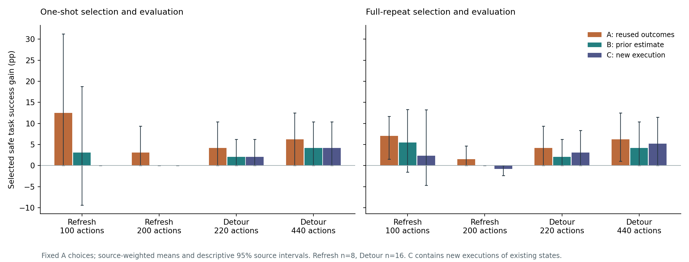

# Beyond Observed Rescue: Evaluating Repeatable Intervention Value in VLA Policies

Working research manuscript, 13 September 2026. Existing A/B analysis and both
prospectively specified C execution blocks are complete.
This manuscript develops a new synthesis; the historical glass manuscript remains unchanged.

## Abstract

When a recovery branch succeeds, does it identify an intervention worth repeating?
We investigate the gap between observed rescue and repeatable intervention value
in vision-language-action policies. Our evaluation combines saved-state branching,
same-policy pseudo-options, separate selection and evaluation blocks, and complete
deadline readouts. We analyze observation refresh for pi0 and a structured detour
for OpenVLA, then test locked forecasts in 332 new executions of existing states.
The results distinguish different kinds of recovery evidence. One-shot Refresh
selection at 100 actions gains 12.50 percentage points on the outcomes used to
select it, 3.12 points on a separate block, and zero on the prospective block.
Its remaining full-repeat positive contribution is explained by local acceleration
across the evaluation deadline. In contrast, full-repeat Detour selection at
440 actions retains gains of 6.25, 4.17, and 5.21 points across the three blocks,
including two sources with benefit in every block. The same-policy negative
control generates apparent gains without a distinct recovery action. Separate-block
forecasting improves the one-shot comparisons, but does not uniformly improve
source-level prediction for full-repeat references. These scoped results show why
observed rescue, repeatable benefit, and deployable selection need distinct evidence:
some opportunities disappear, some persist, and a single replication can also miss
an opportunity that reappears later.

## 1. Introduction

A robot is about to continue an unsuccessful manipulation. A recovery routine takes
over and completes the task. This is a valuable demonstration: the alternative
controller can accomplish something the observed continuation did not. To decide
whether a future robot should intervene in that state, however, the relevant quantity
is the expected improvement over continuing the original policy. A successful
alternative and one unsuccessful continuation do not determine that quantity.

The distinction becomes tangible in a saved-state manipulation example. From the
same Detour-study bundle, one Base execution collides and another succeeds. The
structured alternative succeeds in both corresponding executions. The first
comparison appears to demonstrate rescue; the second demonstrates successful but
unnecessary intervention. A complementary example has repeated Base accidents and
repeated Detour successes. Both examples belong in an evaluation: the first exposes
ambiguity, while the second preserves constructive evidence of recovery.

This paper asks how to distinguish these cases before attributing performance to
an intervention selector. We use a simulator to execute fixed alternatives from
saved decision states and retain repeated outcomes, source identity, and complete
budget readouts. This setting makes a particularly simple negative control possible:
label two executions of Base as two pseudo-options and apply the same hindsight
selection rule. Any apparent improvement then arises without introducing a different
recovery controller. The negative control diagnoses a property of the evaluation;
it is not a deployable action and is not a numerical noise correction for real recovery.

Three separations organize the investigation. First, selecting and scoring with
the same outcomes measures a different object from evaluating the frozen selection
on subsequent executions. Second, finishing just before a deadline can differ from
rescuing a task that would otherwise terminate in an accident. Third, an opportunity
identified using actual branch outcomes can remain inaccessible to a selector that
must act using its current observations. Each distinction changes what a positive
result warrants.

Our evidence comes from two policy interfaces and three development panels. We do
not aggregate their sources into a larger independent sample: the Refresh panels
share underlying source pools, and the mechanisms use different clocks and accident
definitions. Instead, we ask whether the same diagnostic procedure differentiates
their results. It does: a Refresh panel has deadline-sensitive and repeat-sensitive
selection value, a second Refresh panel has no observed task-selection gain, and
Detour retains several actual rescues while damaging many nominally successful tasks
when applied indiscriminately.

The contribution is an empirical evaluation procedure and a measured distinction
between kinds of intervention evidence. The selection-bias principle itself is
established, and our experiments do not propose a new superior recovery policy.
The central practical question is whether an evaluation provides a useful forecast
of subsequent intervention benefit. We test that question with 332 prospective C
executions on saved states, keeping all prior choices and predictions fixed.

## 2. Intervention value and its measurement

Let B denote the nominal policy and R a fixed alternative. For a saved decision
state s and a declared action budget h, Y_a(s,h) is one when executing a completes
the task before an accident and within h; otherwise it is zero. The expectation
q_a(s,h) is defined with respect to the declared continuation and runtime execution
mechanism. The relevant success difference is

\[
\Delta_R(s,h)=q_R(s,h)-q_B(s,h).
\]

The state includes the simulator, controller, policy continuation, delivered
observation, and any queued actions. Matching the starting state does not assert
that all subsequent inputs or computations are deterministic. Runtime variation
therefore remains part of the empirical measurement, even under greedy decoding.

A state where R succeeds can still have zero intervention benefit because Base
also succeeds. Conversely, avoiding an accident without completing the task may
improve a safety objective while leaving this task-success difference unchanged.
We consequently report accident outcomes, lost Base successes, and new accidents
alongside success gain. We do not collapse these outcomes into a freely selected
utility coefficient.

For diagnostic choice, let delta_A(s) select R only when its mean success in
execution block A exceeds Base's; ties retain Base. We measure the same fixed choice
using the A and B outcomes:

\[
G_A=E_s[\delta_A(s)(\bar Y_{R,A}-\bar Y_{B,A})],\qquad
G_B=E_s[\delta_A(s)(\bar Y_{R,B}-\bar Y_{B,B})].
\]

G_A reuses the outcomes that determined the choice. G_B evaluates that choice on a
separate execution block. Neither is a new-source generalization result; both use
the same physical decision states. In particular, G_B is not a certified upper
bound on achievable value, since a finite-sample A choice can miss beneficial states.

An important boundary follows. A pre-specified intervention evaluated through an
appropriately sampled one-shot paired mean need not be biased. Our concern is
reusing the outcome to select its winner, treating a single realization as a
deterministic recoverability label, or interpreting a hindsight oracle as the value
available to an execution-time learner. No claim requires repeating every training
state, and noisy outcomes can still support learning expected values.

A minimal example explains the negative control. Suppose two independent executions
of the same policy each succeed with probability q. Calling the more successful
execution the best option yields an expected apparent gain q(1-q) over the first
execution, despite there being no distinct intervention. At q=0.5, this is 25
percentage points; selecting the same execution index on a fresh independent pair
has zero expected gain. This elementary calculation motivates the control rather
than providing a new theorem. Our actual blocks need not satisfy the example's
independence assumptions, so their observed pseudo-value is reported directly.

## 3. Protocol and evidence

### 3.1 Frozen panels

| Panel | Policy and alternative | Physical sources | Decision episodes | Original branches | A/B repeats per arm | Budgets |
|---|---|---:|---:|---:|---:|---|
| Candidate Refresh | pi0; one observation-queue refresh | 8 | 18 | 288 | 4 / 4 | 100, 200 suffix actions |
| Selection retest | pi0; same refresh interface | 12 | 24 | 384 | 4 / 4 | 100 suffix actions |
| Detour | OpenVLA; fixed structured detour | 16 | 48 | 376 | 2 / 2 | 220, 440 episode actions |

Candidate Refresh comprises all nine historical stale-success configurations and
nine matched-buffer controls; it is a selected development panel. The selection
retest used a separate fixed training-source panel that did not reproduce those
nine configurations. Detour uses on-path glass, off-path glass, and no-glass conditions
for each source. One Detour episode terminates before a candidate is available and
is preserved as a shared outcome, without fabricating repeated branches.

All panels were exposed during earlier development. The new analysis does not
restore their blind-test status. Detour's recovery controller uses privileged
geometry and fixed stage targets. Refresh clears a software observation queue and
requeries the same pi0 policy once; it does not permanently eliminate sensor delay.
The mechanisms and accident predicates are scoped in the accompanying protocols.

### 3.2 Real and pseudo-option selection

We report two principal real-intervention views. The one-shot view selects from
the first A execution of each arm and evaluates the first B execution. The
full-repeat view uses all available A repetitions to select and all B repetitions
to evaluate. The original historical references, whose objectives can additionally
prioritize accident reduction on success ties, are scored separately without change.

For the same-policy negative control, pseudo-arm 0 and pseudo-arm 1 are the first
and second Base executions within each block. The A winner's index is fixed before
reading its B value. A predeclared swapped orientation exposes sensitivity to the
arbitrary indexing. When four repetitions are available, an additional comparison
uses two executions per pseudo-arm, paired with a real two-repetition comparison.
These alternative assignments are dependent diagnostics and do not increase the
number of independent samples.

All aggregate values first average decisions within physical source and then
average sources. Treatment, controls, fitting, and calibration are also reported
separately. Uncertainty intervals use 5,000 paired physical-source bootstrap draws
and describe these development panels. A zero interval for identical recorded
contributions is not a population safety guarantee.

### 3.3 Budget readouts

Each available short and long outcome comes from the same continuous trajectory.
For every A choice, we keep the choice fixed along the entire success and accident
curve. This separates a new execution's effect from a changed deadline's effect.
Detour includes its prefix and recovery actions in the episode budget; Refresh
uses the original suffix action budget. We preserve this distinction rather than
combining their action counts into one measure of recovery speed.

## 4. Existing-record results

### 4.1 Outcome reuse has heterogeneous effects

All gains below are physical-source-weighted safe-task-success percentage points.
The choice stays fixed between A and B. The table includes all panel conditions.

| Panel / budget | Selection repetitions per arm | A gain | B gain | A minus B [95% descriptive interval] |
|---|---:|---:|---:|---|
| Candidate Refresh / 100 | 1 | 12.50 | 3.12 | 9.38 [0.00, 28.12] |
| Candidate Refresh / 100 | 4 | 7.03 | 5.47 | 1.56 [−6.25, 9.38] |
| Candidate Refresh / 200 | 1 | 3.12 | 0.00 | 3.12 [0.00, 9.38] |
| Candidate Refresh / 200 | 4 | 1.56 | 0.00 | 1.56 [0.00, 4.69] |
| Detour / 220 | 2 | 4.17 | 2.08 | 2.08 [0.00, 5.21] |
| Detour / 440 | 2 | 6.25 | 4.17 | 2.08 [0.00, 5.21] |
| Selection retest / 100 | 4 | 0.00 | 0.00 | 0.00 [0.00, 0.00] |

The largest listed change is in one-shot short-budget Refresh. Full-repeat
selection has a smaller change in the same panel, but changing repetition count
also changes the selected policy, so this comparison is not a universal sample-size
law. Detour retains positive value, and its full-repeat A-to-B decrease is only
2.08 points. A claim that all observed recovery value disappears would contradict
these results.

Figure 1. Matched one-observation-per-arm diagnostics. Left: a real alternative
to Base. Right: two execution indices of Base. Bars are source-weighted estimates;
intervals are descriptive source bootstraps. The pseudo-options do not exist as
distinct deployable actions. Swapped and two-repeat variants are retained in the
full evidence, rather than selected after observing favorable contrasts.

### 4.2 A pseudo-option can appear beneficial

At 440 actions, the first-orientation Detour Base/Base control shows 2.08 points
of apparent gain in A and zero in B. Swapping the pseudo-arm identities produces
6.25 points in A and 2.08 in B. Candidate Refresh at 100 actions shows 3.12 points
in A and zero in B under the first one-shot assignment; its swapped assignment is
zero in both blocks. The selection-retest panel is zero throughout these success
diagnostics.

The orientation dependence is informative. It prevents interpreting the control
as a precise estimate of a universal noise floor. In the two-repeat Refresh
assignment at 100 actions, pseudo-value even retains 3.12 of its 7.81 apparent
points on B. A separate block is an empirical check, not an automatic certificate
that a remaining positive value corresponds to a distinct useful action.

### 4.3 A deadline can change the meaning of rescue

In the candidate study's B stale executions, Base and Refresh succeed 23/36 and
26/36 times at 100 actions, but 33/36 and 31/36 times at 200 actions. These are
raw execution counts, distinct from the source-weighted selection table above.
All five positive paired conversions at 100 have a Base continuation that succeeds
at action 101 or 102. The shorter deadline measures a completion-time advantage
for these cases; it does not establish rescue from persistent inability to complete.

The selected policy also changes its apparent value under this check. Keeping the
same one-shot A choice from the 100-action budget, its B gain changes from +3.12
points at 100 to -3.12 points at 200. The full-repeat 100-action choice has zero net
B gain at 200, while still losing some Base successes and introducing a new accident.
The longer readout therefore reveals more than disappearance of a binary advantage:
it can reveal a cost of an intervention that appeared useful at the shorter deadline.

Detour supplies a complementary pattern. At e18 and e21, A/B contain four Base
accidents per state and four Detour completions. Detour completes at episode actions
202 and 432 respectively. The latter requires the longer budget, but its advantage
is not explained by a Base continuation succeeding one or two actions later.

Figure 2. Treatment-condition success curves on B for A choices fixed at the
original deadlines. Controls remain in aggregate tables. The studies use different
action clocks; the curves illustrate different effects of time without selecting
a new favorable primary deadline.

### 4.4 Retained opportunity is not yet deployable value

Detour's A-to-B positive-success intersection contains e18 and e21, both fitting
sources. The calibration sources have no positive B success-difference cell. The
full-input gate therefore offers no additional observed task gain: it selects Base
throughout and achieves the same 67.71% success. AlwaysDetour reaches 39.58% at
440 actions, and the strong risk-to-Detour reference reaches 63.54%.

The full gate was calibrated for 220-action success, with accident conditions at
both budgets. This is a material limitation when interpreting long-budget e21:
the experiment did not independently develop a 440-action gate. Nevertheless,
changing that target would not by itself establish positive calibration support
or protect normal task success. The data currently distinguish actual recovery
examples from an effective execution-time selection method.

## 5. Prospective execution-block replication

The existing-record results motivated one bounded new C block. Before any C
execution, we recorded all A choices, A/B value forecasts, input hashes, checkpoint
identities and scoring rules. The experiment reuses the complete saved states from
both primary panels: 188 Detour branches and 144 candidate Refresh branches, with
no new prefixes or physical sources. Each panel runs in a process separate from
its A/B collection and preserves its original budget and continuation contract.

For each frozen choice, we compare the forecasts G_A and G_B with the new G_C.
We also compare source-level squared prediction errors. The procedure allows
either forecast to win: a positive error-improvement contrast favors B, whereas
a negative contrast favors A. C itself has finite repetitions and is not an exact
measurement of the expected intervention value. All pseudo-option assignments and
historical frozen references remain visible.

### 5.1 Refresh: a prospective check changes the value estimate

The Refresh C job completed all 144 branches in 27 minutes 18 seconds. The one-shot
100-action reference progresses from 12.50 points in A to 3.12 in B to 0.00 in C.
The full-repeat reference retains 2.34 points at 100 actions, but reaches -0.78 at 200.
Choices and forecasts were fixed before this new execution block.

| Reference / budget | A gain | B gain | C gain | Source RMSE A / B |
|---|---:|---:|---:|---:|
| One-shot / 100 | 12.50 | 3.12 | 0.00 | 25.00 / 19.76 |
| Four repeats / 100 | 7.03 | 5.47 | 2.34 | 15.93 / 20.73 |
| One-shot / 200 | 3.12 | 0.00 | 0.00 | 8.84 / 0.00 |
| Four repeats / 200 | 1.56 | 0.00 | -0.78 | 6.63 / 2.21 |

The two reference types use their stated number of observations per arm in each
block; they differ in both selection and evaluation, not just in the precision of
a common C target. Values and RMSE are in percentage points. The full-repeat C
gain at 100 has a descriptive source interval [-4.69,13.28], and the 200-action gain
has interval [-2.34,0.00].

Forecast accuracy is mixed. B is closer than A to C for the one-shot 100 reference,
including source-level prediction error. For the four-repeat 100 reference, B's
aggregate value is closer, but its source-level RMSE is higher. The predeclared
squared-error improvement contrast is -0.01758, with descriptive interval
[-0.04883,0.01367]. Thus separating a single estimation block does not establish
a generally better forecast of source-specific value. The third block is useful
because it can expose this failure rather than assume the forecast improved.

The retained 2.34-point full-repeat gain at 100 also includes 3.91 points of lost
Base successes and 0.78 points of new accidents. Both must accompany the net result.
At 200, the selected policy loses 0.78 points of success and introduces 0.78 points
of new accidents. The one-shot pseudo-options score zero in C at both budgets;
the full evidence retains two-repeat and swapped-index controls as specified.

The residual short-budget value has a concrete explanation. At 100 actions the
full-repeat C reference has one source with a positive net contribution and two
with negative contributions. Its positive selected anchor b14 has Base completion
times 95, 104, 101, 105 and Refresh completion times 95, 94, 94, 94. All eight branches
complete by 105 actions. Thus the positive C contribution preserves local
acceleration, while its apparent task-rescue interpretation remains deadline-sensitive.

Figure 3. A choices and A/B forecasts locked before 332 new executions. Both
one-shot and full-repeat references appear at every original budget. Source-weighted
means and descriptive source intervals are shown; physical sources remain the same
across execution blocks. Pseudo-options and all historical policies are retained
in the full accompanying tables.

### 5.2 Detour: task benefit survives, while one replication can miss it

The Detour C block completed all 188 branches. Full-repeat selection retains
5.21 points of gain at 440 actions, compared with 6.25 in A and 4.17 in B.
The C success rates are 69.79% for the fixed A reference and 64.58% for Base;
the gain has a descriptive source interval of [0.00, 11.46] points. The selected
reference has no observed lost Base success or new accident in C.

| Reference / budget | A gain | B gain | C gain | Source RMSE A / B |
|---|---:|---:|---:|---:|
| One-shot / 220 | 4.17 | 2.08 | 2.08 | 8.33 / 0.00 |
| Two repeats / 220 | 4.17 | 2.08 | 3.12 | 4.17 / 4.17 |
| One-shot / 440 | 6.25 | 4.17 | 4.17 | 8.33 / 0.00 |
| Two repeats / 440 | 6.25 | 4.17 | 5.21 | 4.17 / 4.17 |

The constructive cases remain e18 and e21: both have positive benefit in A, B,
and C. Detour's C executions finish at 202 and 432 episode actions respectively.
The e18 Base outcomes in C are an accident and noncompletion at 440; the e21 Base
outcomes are two accidents. These are not the short catch-up pattern observed in
Refresh. They establish finite-budget recovery benefit on these saved states.

A third source illustrates the other direction of error. At e15, full-repeat
benefit changes from 0.5 in A to zero in B and back to 0.5 in C. The C Base
executions succeed at action 70 and collide at action 41, while both Detour
executions succeed at 209. Rejecting this opportunity solely because B had zero
observed gain would therefore miss its subsequent reappearance. All three positive
C sources are on the fitting side; calibration still has no positive success-difference
cell. The learned gate remains Base throughout, with C success 64.58%, compared
with 60.42% for the strong risk reference and 39.58% for AlwaysDetour.

For full-repeat Detour, A and B have equal source-level forecast RMSE, and the
predeclared error-improvement contrast is zero, with interval [-0.00521, 0.00521].
Together with the Refresh result, this limits the strong claim that one separate
estimation block generally improves source-specific value prediction. The useful
conclusion is empirical: prospective execution distinguishes gains that disappear,
gains that persist, and opportunities whose evidence varies across small blocks.

## 6. Related work and the contribution boundary

[SAFE](https://arxiv.org/abs/2506.09937) develops failure detection using internal
VLA features. Our question concerns the consequences of alternative actions after
a candidate state is identified; it does not introduce a new hidden-state detector.
[LIBERO-RECOVER](https://arxiv.org/abs/2609.05178) evaluates recovery across a much
larger collection of failure scenarios. Our panels do not compete on benchmark
breadth, and the contribution cannot be the existence of recovery evaluation alone.

[B2FF](https://arxiv.org/html/2606.09258v1) trains a recoverability-aware milestone
selector using counterfactual rollout supervision. It includes an online-triggered
variant as well as controlled recovery timing and timing ablations. Our diagnostics
address the interpretation of realized option outcomes; they do not establish that
B2FF's reported results suffer the same effect. [CoRe](https://arxiv.org/abs/2608.14822)
studies inference-time recovery through counterfactual realignment. A direct
comparison would need to align recovery permissions, physical costs and accident
definitions, rather than compare unmatched success rates.

The statistical ideas behind sample splitting and cautious policy improvement are
also established. [Decision-Point Guided Safe Policy Improvement](https://proceedings.mlr.press/v258/sharma25a.html)
studies improvement where data support is sufficient, and
[Guarantees on Robot System Performance Using Stochastic Simulation Rollouts](https://arxiv.org/abs/2309.10874)
studies finite-sample performance guarantees. We do not claim novelty for retaining
Base under uncertainty, repeating stochastic rollouts, or using a confidence
interval. The intended empirical contribution is to demonstrate when these issues
change recovery conclusions and to test the predictive usefulness of the resulting
evaluation on subsequent executions.

## 7. Limitations and implications

The evidence is deliberately scoped. Sources are few and previously exposed,
candidate Refresh configurations were historically selected, and Detour is a
privileged structured controller in one task family. Runtime blocks may differ
systematically; their variation cannot be attributed to IID policy noise alone.
Neither a fixed controller's failure nor a low diagnostic reference value proves
physical irrecoverability or the absence of a better allowed controller.

A strong competing explanation remains: limited recovery skills and state support
may dominate the poor learned-selector results. An external mechanism with
independently established recovery capability would help determine whether the
measurement findings extend beyond the present interfaces. That replication is an
outstanding scientific question, not an already completed contribution.

The practical implication of the current evidence is nevertheless concrete. A
successful recovery branch, repeat-disjoint selection benefit, and successful
deployment answer different questions. Reporting them separately preserves genuine
recovery examples while making clear which opportunities remain to be learned.
