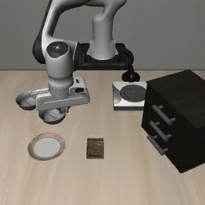

# Phase 2-④ grasp_instability (cat-5): snapshot-resume — NEGATIVE (harness wall)

> Two attempts, same conclusion. #1 (resume OpenVLA from a perturbed grasp snapshot) was
> CONFOUNDED; #2 (closed-gripper static HOLD) **isolates and confirms** the root cause: a live
> grasp does not round-trip through `set_init_state` (the grip force isn't in the saved state).
> The headline paper story does not depend on this — see "Implication" + the revisit design below.

**Goal.** A grasp-instability pre-crash state = target object held but precariously, so the
nominal policy drops it. Crash = the held object is lost (cat-5).

**Design.** Harvest a real grasped-lift state from OpenVLA on high-competence libero-spatial
task 0 ([`scripts/phase2_grasp_recon.py`](../scripts/phase2_grasp_recon.py): first step the bowl
rises >4 cm while grasped, step 65, nominal then succeeds), then resume OpenVLA from that state
with the bowl seated more eccentrically in the gripper (lateral offset `delta`). Rich per-trial
diagnostics, K=4 ([`scripts/phase2_grasp.py`](../scripts/phase2_grasp.py)).

## Result — CONFOUNDED (no clean signal)

| delta (m) | fair trials | provisional crash |
| --- | --- | --- |
| 0.000 (no perturbation) | 4 | **3/4** lost the bowl |
| 0.015 – 0.045 | 0 | all `pre_drop` (grasp broke on reset, before the policy acted) |

Two problems, both pointing to the same root cause:

1. **delta=0 already "drops" 3/4** — but the *continuous* nominal rollout reached this exact
   state and went on to succeed. Restoring the state and resuming should not change the outcome
   if the state were fully captured. The video shows the bowl sitting ~4 cm up at reset and
   simply ending back on the table — the restored grasp was never solid.
2. **any delta ≥ 1.5 cm breaks the grasp instantly on reset** (`pre_drop`) — there is no margin
   to tune eccentricity by editing the object pose.

**Root cause.** robosuite/LIBERO's flat state vector `[time, qpos, qvel]` does **not** capture
the gripper actuator's internal target or the contact solver warm-start, so a *restored*
mid-grasp is marginal — it neither reproduces the original secure hold nor responds smoothly to
small pose edits. So snapshot-resume cannot fairly author a grasp-instability scenario.

## Meta-finding (across Phase 2-④)

This is the **third** time a fine-grained *edited / restored dynamic* pre-crash state proves
finicky or confounded:
- closed-fixture (no-wall #1): policy not competent enough to act → nothing hit;
- object-on-path (no-wall #2): vertical grasp clears short table objects;
- grasp restore (here): restored grasp is marginal (state vector incomplete).

> The wall-injection worked because it is a **static scene edit** (add a jointless body) that
> perturbs *nothing* about the robot/grasp/contact state and sits on a **high-competence** path.
> Fine-grained *dynamic* pre-crash states (precarious grasps, articulation timing, clutter
> sweeps) are hard to author *fairly by state-editing* in robosuite.

## Implication for next attempt (from-scratch, not state-editing)

Author grasp-instability **without restoring a grasp**: start the bowl in a hard-to-grasp pose
on the table (e.g. tilted on its rim) and let OpenVLA grasp it **live**, so the grasp/contact
state is built by physics, not restored. Crash = it slips during the live lift. This avoids the
restoration artifact (though it may surface its own difficulties). Alternatively, accept that
the strongest, cleanest CrashBench instrument is the static on-path obstacle and prioritize
categories that are static scene edits over dynamic-state ones.

## Attempt #2 — closed-gripper HOLD filter: decisive confirmation of the root cause

The attempt-#1 run still mixed three possible causes (incomplete state, OpenVLA re-planning from a
single frame, and a settle step that *opens* the gripper). A clean control isolates it. Reset to
each candidate and apply a **benign HOLD** — zero eef motion, gripper commanded **CLOSED**, no
policy, no gripper-open step — for 15 steps
([`scripts/phase2_grasp_build.py`](../scripts/phase2_grasp_build.py), job 5407165):

| state | HOLD verdict | min bowl z | peak finger force |
| --- | --- | --- | --- |
| **control (no perturbation)** | **dropped to table** | 0.898 | **1.5 N** |
| t6 / t14 / t18, most offsets | dropped to table | 0.898 | 0–96 N |
| t10, xm_m06, yp_m11, ym_m11 ("held") | held at ~0.94 | 0.94 | 25–50 N |

| Control: dropped under static closed-gripper HOLD (no grip) | "held" via penetration artifact (fake grip) |
| --- | --- |
|  |  |

**peak finger force ≈ 1.5 N on the control = the fingers carry no load after reset.** With arm
motion, policy, and gripper-opening all removed, the restored grasp *still* fails under pure
gravity — so the cause is specifically that the **active gripper squeeze is absent from the
restored state** (it lives in the controller/actuator, not in `[time, qpos, qvel]`). The four
"held" states are a red herring: they hold only via 25–50 N of *penetration* contact from the
perturbation shoving the bowl rim into a finger — a fake grip, not a graspable hold. So no
candidate (control = no grip; "held" = fake grip) is scientifically usable → **snapshot-resume is
confirmed unviable** for grasp_instability. Build artifacts: `results/grasp/build.json` (kept) +
HOLD gifs in `results/grasp/build/` (bulk, gitignored; two curated into `setup/figures/`); the
throwaway `scenarios_grasp/` is gitignored (regenerable via the build script).

## Files
- recon: [`scripts/phase2_grasp_recon.py`](../scripts/phase2_grasp_recon.py) → `results/grasp/recon.json`, `snapshot_state.npy`
- author+eval (attempt #1): [`scripts/phase2_grasp.py`](../scripts/phase2_grasp.py) → `results/grasp_instability.json`
- HOLD filter (attempt #2): [`scripts/phase2_grasp_build.py`](../scripts/phase2_grasp_build.py) → `results/grasp/build.json`
- clean rollout harness (num_steps_wait=0), staged but **not run** (control proven invalid): [`scripts/phase2_grasp_run.py`](../scripts/phase2_grasp_run.py)
