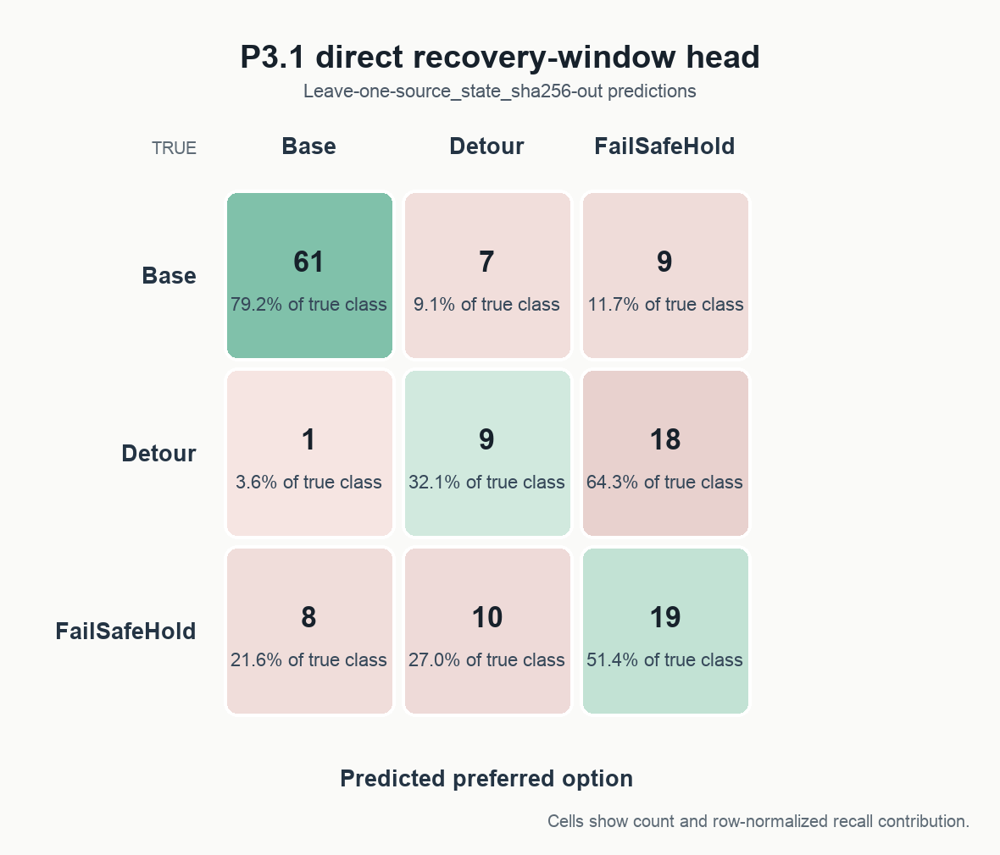

# P3.1 Direct Recovery-Window Routing Head

Status: **development candidate; not yet dynamically confirmed**.

This development experiment fits one standardized multinomial linear softmax head to the frozen Router's 10 prediction outputs. There is no temporal encoder, no rollout, no hyperparameter sweep, and no change to the frozen Router's lambda, margin, or alpha.

## Protocol

- Records: **142** across **9** unique `source_state_sha256` values.
- Model input: only `router_output_feature` (10 values).
- Model: standardized three-class linear softmax with fixed `L2=0.01`; each source has equal total training weight.
- Evaluation: strict leave-one-`source_state_sha256`-out. All rows from a held-out source share one fold; standardization and fitting are repeated using training sources only.
- Decision: class argmax; no threshold or margin was selected on OOF results.
- Ranking AUCs are ordinary record-level ROC AUCs. Recovery uses OOF `P(Detour)`; intervention uses OOF `1-P(Base)`.

## Out-of-fold core results

| Method | Source-macro accuracy | Macro-F1 | Base recall | Detour recall | Hold recall | Recovery-open vs hard-negative AUC | Intervention-needed vs hard-negative AUC |
|---|---:|---:|---:|---:|---:|---:|---:|
| Old Router scalar advantage (raw sign choice) | 0.181 | 0.144 | 0.013 | 0.821 | 0.054 | 0.351 | 0.338 |
| Old Router original operational decision | 0.167 | 0.138 | 0.013 | 0.750 | 0.054 | 0.472* | 0.331* |
| Direct recovery-window head (strict OOF) | **0.632** | **0.540** | 0.792 | 0.321 | 0.514 | **1.000** | **0.995** |

Scalar classification uses its natural untuned sign rule: choose the old non-Base candidate only when max non-Base advantage is strictly positive; its AUC columns use the continuous advantage. No threshold was fitted.

\*The old operational row has only a discrete choice, so these two AUCs are tie-heavy decision-level diagnostics, not continuous ranking curves.

Macro-F1 is the unweighted mean over the fixed class set Base, Detour, and FailSafeHold. Source-macro accuracy first computes accuracy within each source and then weights all sources equally.

## Held-out source results

| Fold | Held-out source | Placement | Type | N | Accuracy | Macro-F1 | Base / Detour / Hold recall | Predicted Base / Detour / Hold |
|---:|---|---|---|---:|---:|---:|---|---|
| 0 | `3029be84f038...` | 0009 | dense_glass_anchor:16 | 16 | 0.625 | 0.427 | n/a / 0.375 / 0.875 | 2 / 3 / 11 |
| 1 | `34aaec9758de...` | 0003 | dense_glass_anchor:16 | 16 | 0.188 | 0.154 | 0.000 / n/a / 0.375 | 0 / 11 / 5 |
| 2 | `aae24500d1a1...` | 0010 | hard_control_negative:19 | 19 | 1.000 | 0.333 | 1.000 / n/a / n/a | 19 / 0 / 0 |
| 3 | `c4cebac9c988...` | 0010 | dense_glass_anchor:16 | 16 | 0.375 | 0.300 | 0.000 / 0.444 / 1.000 | 0 / 4 / 12 |
| 4 | `c4f07c7a1f31...` | 0019 | hard_control_negative:20 | 20 | 1.000 | 0.333 | 1.000 / n/a / n/a | 20 / 0 / 0 |
| 5 | `dde8da808090...` | 0019 | dense_glass_anchor:16 | 16 | 0.250 | 0.133 | n/a / n/a / 0.250 | 7 / 5 / 4 |
| 6 | `e973b9b35d54...` | 0004 | dense_glass_anchor:16 | 16 | 0.312 | 0.220 | 0.000 / 0.182 / 1.000 | 0 / 3 / 13 |
| 7 | `ee80df3b6635...` | 0008 | hard_control_negative:7 | 7 | 1.000 | 0.333 | 1.000 / n/a / n/a | 7 / 0 / 0 |
| 8 | `f503237b7743...` | 0009 | hard_control_negative:16 | 16 | 0.938 | 0.323 | 0.938 / n/a / n/a | 15 / 0 / 1 |

Per-source macro-F1 also uses the fixed three-class set; a correctly classified single-class hard-control source therefore has macro-F1 `0.333`, not `1.000`.

## Pre-specified trajectory diagnostics

| Diagnostic | Support | Old scalar sign | Old operational | Direct OOF |
|---|---:|---:|---:|---:|
| 0004 recovery-open recall | 11 | 0.909 | 0.818 | 0.182 |
| 0009 recovery-open recall | 8 | 0.625 | 0.625 | 0.375 |
| 0010 recovery-open recall | 9 | 0.889 | 0.778 | 0.444 |
| 0003 Hold recall | 8 | 0.000 | 0.000 | 0.375 |
| 0019 Hold recall | 16 | 0.125 | 0.125 | 0.250 |
| Hard controls retained as Base | 62 | 0.000 | 0.000 | 0.984 |

## Interpretation

Relative to the old scalar axis, the direct head changes recovery-open vs hard-negative ordering by **+0.649 AUC** and intervention-needed vs hard-negative ordering by **+0.657 AUC**.

No preferred-option class collapses globally under strict OOF argmax.

The gain is not uniform option recovery: direct OOF Detour recall is `0.321`, and it is lower than the old operational choice on each of 0004/0009/0010. The strongest evidence is the recovery-v-hard ordering plus hard-control Base retention; the main residual error is Detour/FailSafeHold confusion.

The development evidence is sufficient to enter **one frozen dynamic closeout** as a decisive online test, not as a deployment claim.
This is a development judgment only: the saved all-record head has not been dynamically confirmed, and no OOF result is an online outcome.

## Saved candidate

`results/p3_1_direct_recovery_head_model.npz` was fitted once on all 142 P3.0 records using the identical fixed model and regularization. It is explicitly marked **development candidate; not yet dynamically confirmed**.

The candidate consumes only the 10-D frozen prediction-output vector. Horizon, collision-relative timing, action index, trajectory/source identifiers, and true option outcomes are absent from its feature matrix.
